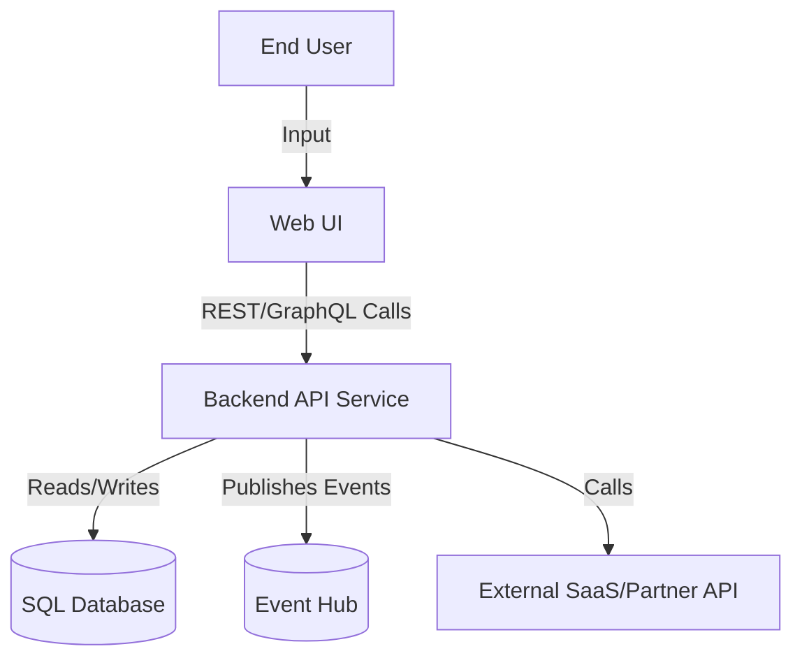

# Privacy & Security Policy

This file defines **privacy-by-design and secure-by-default enforcement rules**.
Agents must use this knowledge to ensure **privacy tagging, secure telemetry, and updated data flow documentation** during code **generation and code review**.

## Purpose
- Enforce **secure coding** and **privacy-by-design** principles.
- Ensure **privacy tagging** of telemetry and logging.
- Keep **Data Flow Diagrams (DFDs)** up to date.

## Rules

### Secrets
- No plaintext secrets in code.
- Always prefer **Managed Identity** over credentials.

### Data Protection
- Encrypt sensitive data in transit and at rest.
- Validate and sanitize all user input.

### Telemetry & Logging
- All events must be checked against `privacy-manifest.json`.
- Missing events must be suggested with:
  - EventName
  - DataCategory (Non-PII, Pseudonymous, Identifiable)
  - RetentionDays
  - Justification
- Telemetry/logging must be tagged with **correct privacy category and retention**.
- Annotate code with **privacy/security attributes** where applicable.

## Privacy Enforcement
- Detect telemetry/logging calls (e.g., `TrackEvent`, `logger.Log*`).
- Validate that each call is registered in `privacy-manifest.json`.
- Auto-suggest manifest entries for new events.
- Validate inputs using data annotations or FluentValidation.

## Responsibilities for Agents

On **new feature code generation or repo changes**, agents must:
1. Identify security-sensitive flows (input, processing, storage, sharing).
2. Update `docs/threatmodel.md` with risks & mitigations.
3. Generate or update Mermaid-based DFDs in `docs/dfd.md`.

DFDs must include:
- Actors (User, Admin, External System)
- Processes (WebApp, API, Service)
- Data Stores (SQL DB, Blob Storage)
- Data Flows (arrows showing interactions)

## Example DFD (Mermaid)



## Example privacy-manifest.json

```json
{
  "ServiceId": "sales-planning-ai-service-treeid",
  "PrivacyAssessmentId": "your-s360-assessment-id",
  "TelemetryEvents": [
    {
      "EventName": "SegmentationScenarioCreated",
      "DataCategory": "Pseudonymous",
      "RetentionDays": 30,
      "Justification": "Tracks creation of segmentation scenarios for audit and optimization"
    },
    {
      "EventName": "UserFeedbackSubmission",
      "DataCategory": "Identifiable",
      "RetentionDays": 90,
      "Justification": "Captures user feedback for continuous improvement"
    }
  ]
}
```

## Acceptance Criteria

- **AC-001:** Given a new telemetry event, when it is added to code, then it must be mapped in `privacy-manifest.json`.
- **AC-002:** Given a repo change, when new endpoints or data stores are introduced, then agents must update `docs/dfd.md`.
- **AC-003:** Given a feature with new telemetry, when agents review, then both `privacy-manifest.json` and `docs/dfd.md` must reflect the new flows.
