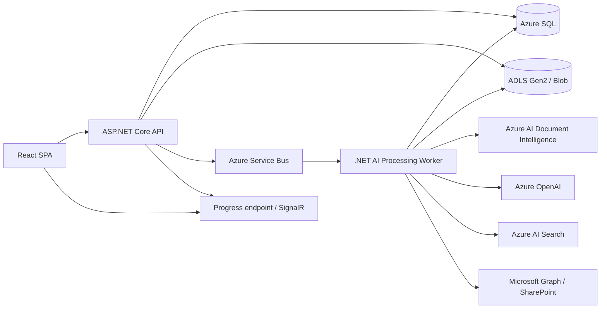

# AI Dossier Preparation - Detailed Design

**Status:** Proposed for human approval

**Date:** 2026-09-29

**Related requirements:** Sprint 1 stories 7, 9, 12, 13, 15, 16, 21, 22

**Parent design:** [Software Design Document](SDD.md), especially sections 4.5-4.8, 4.12, 5, 6, and 8

**Architecture decision:** [ADR-019](ADR-019-ai-dossier-processing-worker.md)

## 1. Purpose

This document turns the AI and dossier-preparation concepts in the SDD into an
implementation-ready design for the current React, ASP.NET Core, Azure SQL, Blob
Storage, Azure AI Search, and Azure OpenAI solution.

The first release is an end-to-end vertical slice for **CTD Module 3 - Quality**.
It produces a reviewable dossier package by finding, extracting, classifying,
and arranging existing approved source documents. It does **not** generate new
regulatory narrative or invent content for missing sections.

## 2. Relationship to the Current SDD

The current SDD already provides a strong high-level target:

- Section 4.5 defines template-guided discovery and OCR.
- Sections 4.6 and 5.2 define hybrid document classification.
- Section 4.7 defines multi-signal assignment into template slots.
- Section 4.8 defines deterministic gap analysis.
- Section 4.12 defines orchestration and physical dossier compilation.
- Sections 6 and 8 define the target data stores and durable processing model.
- ADR-013 through ADR-015 define template-driven processing and compilation.

The SDD is not sufficient by itself for implementation because:

- Most target AI tables and services in section 6.2 do not exist in the current
  SQL project.
- The current API exposes seeded dossier-run and document-tree responses rather
  than a real processing pipeline.
- The current PDF template catalog stores files but does not parse them into
  nodes and slots.
- Source connectivity validation is currently simulated.
- Azure OpenAI, Search, and Storage infrastructure exist, but Document
  Intelligence, Service Bus, and a durable worker host are not provisioned.
- The API project does not yet reference the Azure AI SDKs needed for extraction,
  OCR, classification, embeddings, Search, or Blob processing.

This document narrows the SDD to a first executable increment and resolves the
meaning of "dossier draft": it is a compiled, evidence-based package of existing
documents, not AI-authored regulatory prose.

## 3. Confirmed Product Decisions

| Decision | Selected behavior |
|---|---|
| Drafting mode | Compile existing source documents only |
| Missing content | Record an explicit gap; never generate substitute content |
| Template input | Admin uploads PDF |
| Template interpretation | AI proposes nodes and slots; Admin reviews and publishes the structured definition |
| First release | Module 3 Quality end-to-end vertical slice |
| Human control | Admin approves templates; RA Lead reviews assignments and approves compilation |

## 4. Intended User Outcome

An RA Lead selects **Prepare Dossier** for a project. The system resolves the
project's active Module 3 template and source configuration, scans the source,
extracts and classifies documents, maps them to approved template slots, shows
uncertain assignments and gaps for review, and compiles:

1. A Module 3 folder tree containing the selected source documents.
2. An assembled review PDF containing a cover page, table of contents, source
   document pages in CTD order, provenance, and visible gap placeholders.
3. A gap report.
4. A machine-readable manifest with provenance and hashes.

The source documents remain authoritative. The system copies or references them;
it does not rewrite their scientific or regulatory content.

## 5. Scope

### 5.1 In scope for the vertical slice

- Parse an admin-uploaded Module 3 PDF into a proposed hierarchy and slot list.
- Admin review, correction, validation, and publication of that structure.
- Resolve project override first, then global template.
- Resolve project source override first, then global source.
- Connect to Azure Blob Storage and SharePoint Online using Managed Identity or
  delegated access appropriate to the connector.
- Discover PDF and DOCX documents for Module 3.
- Extract text and metadata; OCR scanned PDFs.
- Apply deterministic rules and Azure OpenAI classification for ambiguous files.
- Map documents to Module 3 template slots using folder, filename,
  classification, and optional LLM disambiguation signals.
- Persist evidence, confidence, alternatives, and manual overrides.
- Compute deterministic gaps.
- Detect both missing-document gaps and content-coverage gaps inside assigned
  documents.
- Display gap status directly on every affected tree node and provide a
  node-level remediation panel.
- Allow an authorized user to upload a document that fills an empty slot or
  replaces a deficient primary document.
- Compile and store the review package.
- Display durable progress and actionable failures.

### 5.2 Out of scope for the vertical slice

- AI-authored CTD narrative.
- Automatic regulatory conclusions or scientific claims.
- Modules 1, 2, 4, and 5.
- eCTD publishing, validation, or gateway submission.
- Automatic acceptance of an AI-parsed template without Admin approval.
- Runtime parsing of the template PDF on every dossier run.
- On-premises SharePoint.
- A broad unrestricted repository scan beyond configured Module 3 paths.

## 6. Architecture



### 6.1 Components

| Component | Responsibility |
|---|---|
| React SPA | Template review, Prepare Dossier action, progress, assignment review, gaps, downloads |
| ASP.NET Core API | Authorization, commands, queries, run creation, approval, download mediation |
| AI Processing Worker | Durable orchestration and per-document processing |
| Azure Service Bus | Decoupled run and document work queues, retry, dead-letter handling |
| Azure SQL | Run state, template structure, document metadata, assignments, gaps, audit |
| Blob Storage | Template files, extracted text, cached originals where allowed, compiled packages |
| Document Intelligence | OCR and layout extraction for scanned or table-heavy documents |
| Azure OpenAI | Ambiguous classification, template parsing proposal, slot disambiguation |
| Azure AI Search | Chunk and metadata index for retrieval and later Copilot use |

The worker is separate from the interactive API so long-running OCR and AI work
survives API restarts, scales independently, and can be retried without repeating
completed steps.

## 7. Template Publication Flow

The uploaded PDF is guidance input, not the runtime data model.

1. Admin uploads a valid PDF for Module 3.
2. API stores the immutable PDF in `ara-overrides/templates/{templateId}/`.
3. A `TemplateParse` job is queued.
4. Worker extracts layout with Document Intelligence.
5. Azure OpenAI converts headings, numbering, guidance, and expected document
   descriptions into a strict JSON proposal.
6. The proposal is schema-validated and persisted as `Draft`.
7. Admin reviews the hierarchy, edits node names, slot names, mandatory flags,
   aliases, filename patterns, and expected classifications.
8. Validation confirms unique node keys, unique slot keys, valid parent links,
   deterministic ordering, and at least one leaf slot.
9. Admin publishes an immutable version.
10. Dossier runs lock to the published version. Later edits create a new version.

AI parse output must never become active merely because model output is
syntactically valid.

## 8. Dossier Preparation Flow

### 8.1 Run creation

`POST /api/v1/projects/{projectId}/dossier-runs`

The API:

1. Authorizes `DossierManagement.Write`.
2. Resolves the published project/global template and source configuration.
3. Rejects the request if either is missing or the template is still Draft.
4. Creates a `DossierRun` with a snapshot of template and source versions.
5. Writes an audit event and queues `StartDossierRun`.
6. Returns `202 Accepted` with the run identifier.

### 8.2 Durable stages

| Stage | Processing | Durable output |
|---|---|---|
| Resolve | Lock template and source versions | Run snapshot |
| Discover | Walk Module 3 nodes and connector folders | Discovered document records and structural anomalies |
| Extract | Download safely, hash, virus-scan status, extract text and metadata | Document and extracted-text blob |
| OCR | Process scanned pages and tables | OCR text, pages, confidence |
| Classify | Rule-first category classification; LLM only when ambiguous | Classification with method and confidence |
| Map | Score candidate slots using explainable evidence | Slot assignments or unassigned items |
| Index | Chunk, embed, and upload searchable content | Search index documents |
| Analyze | Project assignments over every required slot | Gap run |
| Review | Show node gaps; accept remediation uploads; reprocess affected nodes; wait for RA Lead approval | Review decisions, replacement lineage, and audit events |
| Compile | Create folder tree, review PDF, gap report, and manifest | Immutable dossier package |

Every stage is idempotent. The idempotency key for a source document is:

`projectId + sourceConfigVersion + canonicalSourceUri + contentHash`

### 8.3 Discovery

For each published Module 3 node:

1. Build the expected folder path from the approved template hierarchy.
2. Search every configured source using node names and approved aliases.
3. Enumerate supported files from matched folders.
4. Record `MissingFolder` when no configured source contains a match.
5. Preserve source URI, source version, timestamps, and connector metadata.

The first release does not recursively scan unrelated locations. An optional
bounded sweep can be introduced later for misfiled documents.

### 8.4 Extraction and OCR

- Native text PDF and DOCX content is extracted without OCR where possible.
- Scanned PDFs are sent to Document Intelligence.
- Layout extraction is used for tables such as specifications and certificates.
- Each page retains page number and extraction confidence.
- Unsupported, encrypted, oversized, or corrupt files become actionable
  processing errors and do not silently disappear.
- Original files are not sent to Azure OpenAI. Only the minimum extracted text
  needed for classification or disambiguation is included in prompts.

### 8.5 Classification

The classifier first applies versioned deterministic rules:

- filename patterns;
- folder path terms;
- document metadata;
- weighted keywords from the first relevant pages.

If the top deterministic score is below the configured threshold, Azure OpenAI
returns a structured result:

```json
{
  "category": "StabilityReport",
  "confidence": 0.93,
  "reasonCodes": ["LONG_TERM_CONDITIONS", "STABILITY_TIMEPOINTS"],
  "alternateCategories": [
    { "category": "BatchAnalysis", "confidence": 0.05 }
  ]
}
```

Free-form model reasoning is not displayed as fact. The system stores compact
reason codes and the prompt/model/rule versions required for audit.

### 8.6 Slot mapping

Candidate scores are computed from:

| Signal | Initial weight |
|---|---:|
| Approved source-folder match | 0.50 |
| Approved filename pattern | 0.20 |
| Classification match | 0.20 |
| LLM disambiguation | 0.10 |

An assignment becomes `Assigned` only when it meets both the minimum score and
separation from the second candidate. Otherwise it becomes `NeedsReview`.
Documents with no acceptable candidate become `Unassigned`.

An RA Lead can reassign, select a primary version, or suppress a duplicate.
Manual decisions always take precedence on rerun unless explicitly reset.

### 8.7 Gap analysis

Gap analysis has two layers.

#### 8.7.1 Document-presence and structural gaps

This layer is deterministic and does not call an LLM. For every published
template node and slot it checks:

- assigned versus missing;
- mandatory versus optional;
- duplicate content hash;
- newer alternative version;
- expired effective date;
- low-confidence or unresolved assignment;
- missing source folder.

#### 8.7.2 Content-coverage gaps

A slot may have an assigned document but still be incomplete. Each published
slot therefore carries an Admin-approved `coverageChecklist`, derived from the
template and corrected before publication. A checklist item is a bounded,
testable evidence expectation, for example:

- stability conditions are stated;
- tested batches are identified;
- time points are present;
- acceptance criteria are present;
- deviations and conclusions are present.

The worker evaluates extracted document content against each checklist item.
Rules and structured extraction are preferred for dates, identifiers, tables,
and required headings. Azure OpenAI may propose whether narrative evidence is
present, but it must return structured evidence citations:

```json
{
  "checkKey": "STABILITY_TIMEPOINTS",
  "status": "Missing",
  "confidence": 0.91,
  "evidence": [],
  "reasonCode": "NO_TIMEPOINT_EVIDENCE"
}
```

An item is never considered satisfied based only on model assertion. A
`Satisfied` result must include one or more citations to extracted pages or
paragraphs. Low-confidence results become `NeedsReview`, not automatic gaps.

Content analysis detects absence of expected evidence; it does not judge whether
the scientific result is acceptable or generate the missing scientific content.

#### 8.7.3 Gap types and roll-up

| Gap type | Meaning | Default remediation |
|---|---|---|
| `MissingFolder` | Expected source folder was not found | Correct source or upload at affected node |
| `MissingDocument` | Required slot has no assigned document | Upload document and assign it as primary |
| `ContentGap` | Assigned primary document lacks one or more approved checklist items | Upload a replacement document; original becomes an alternate |
| `NeedsReview` | Classification, assignment, or coverage result is uncertain | Human decision or replacement upload |
| `Duplicate` | Multiple equivalent documents exist | Select primary or suppress duplicate |
| `VersionConflict` | A newer or conflicting version exists | Select the authoritative primary |
| `Expired` | Primary document exceeds configured validity | Upload current replacement |
| `ProcessingFailure` | File could not be extracted, OCR processed, or analyzed | Retry or upload a readable replacement |

A leaf node's status is derived from its slots and coverage checks. Parent nodes
show the highest-severity descendant state plus aggregate counts. Module 3 shows
the aggregate state for its entire subtree.

A run can compile with unresolved gaps, but the package is marked
`IncompleteMandatory` when a mandatory missing-document or content-coverage gap
remains.

### 8.8 Gap tree and node interaction

The arranged dossier tree is the primary gap-navigation surface. Every node
shows:

- a status icon and accessible text label;
- counts for missing documents, content gaps, and review items;
- a completion ratio for its descendant slots;
- a visual distinction between blocking and non-blocking gaps.

Recommended states:

| State | Tree treatment |
|---|---|
| Complete | Green check |
| Partial / optional gap | Amber indicator |
| Blocking mandatory gap | Red indicator |
| Needs review | Blue review indicator |
| Processing | Neutral spinner |
| Failed | Red error indicator |

Selecting a node opens a **Gap details** panel rather than only expanding the
tree. The panel contains:

1. Node code, title, template guidance, and status.
2. Expected slots and coverage checklist.
3. Current primary document and alternatives.
4. Gap cards with type, severity, explanation, expected evidence, detected
   evidence, source citations, confidence, and suggested action.
5. Processing history and previous remediation uploads.
6. Actions allowed by permission and run state.

For a `MissingDocument` gap, the main action is **Upload document**. For a
`ContentGap`, `Expired`, or `ProcessingFailure`, the main action is
**Upload replacement**. The current document remains available for comparison.

Gap details use stable reason codes and cited evidence. Raw chain-of-thought or
unsupported model reasoning is never displayed.

### 8.9 Remediation upload and reprocessing

Remediation uploads are run-scoped, project-owned evidence files. They do not
silently change the global source repository or the published template.

1. User selects the affected gap and uploads a supported document.
2. API validates authorization, run editability, extension, MIME signature,
   size, malware-scan status, and optimistic-concurrency token.
3. The file is stored in
   `content/{projectId}/remediation/{runId}/{nodeId}/{documentId}/`.
4. A `GapRemediation` record links the upload to the exact node, slot, gap, and
   document it is intended to fill or replace.
5. Only the uploaded document is processed through extraction, OCR,
   classification, content-coverage analysis, and slot validation.
6. For `MissingDocument`, a valid upload becomes the slot's primary assignment.
7. For `ContentGap`, `Expired`, or `ProcessingFailure`, a valid upload replaces
   the primary assignment. The previous primary is retained as an alternate
   with `SupersededByRemediation`, preserving provenance.
8. The affected node and ancestor statuses are recalculated.
9. The UI receives a progress update and refreshes the node details and tree
   counts.
10. If the run was already compiled, the existing package remains immutable and
    the run becomes `RecompileRequired`.

The uploaded document must be relevant to the selected slot. If classification,
slot score, or content coverage is below threshold, it remains
`RemediationNeedsReview`; it is not stitched into the approved package
automatically.

Users can withdraw an unapproved remediation. Once a remediation has been
approved and compiled, changing it creates a new dossier package revision.

### 8.10 Human approval

Before compilation, the RA Lead sees:

- low-confidence classifications;
- `NeedsReview` assignments and their evidence;
- unassigned files;
- missing mandatory and optional slots;
- content-coverage gaps within assigned documents;
- duplicates and version conflicts;
- structural folder gaps.

Compilation requires explicit approval. The approval stores the actor, timestamp,
run revision, unresolved-gap count by type, accepted exceptions, and selected
output options. A blocking gap may only be accepted as an exception when the
user has the required permission and provides a rationale; the exception is
shown in the package and audit trail.

### 8.11 Compilation and stitching

The compiler creates:

```text
dossier-packages/{projectId}/{runId}/
  dossier/
    Module 3 - Quality/
      3.2.S - Drug Substance/
      3.2.P - Drug Product/
  Module3Review.pdf
  GapAnalysis.pdf
  manifest.json
```

The folder tree contains copies or storage-side references to approved source
documents. Approved remediation uploads participate in compilation exactly like
discovered source documents:

- a missing-document upload occupies the previously empty slot;
- a replacement upload becomes the primary document;
- the superseded document is moved to `__alternates/` with provenance metadata;
- the manifest records the remediation, actor, reason, old/new hashes, approval,
  and package revision.

`Module3Review.pdf` contains:

- cover and generation metadata;
- table of contents;
- section and slot inventory;
- section separator pages followed by the approved primary document's pages in
  template order;
- document title, version, effective date, source, hash, classification, and
  assignment confidence;
- links to the full source copy;
- explicit `MISSING` placeholders.

PDF remediation and source files are page-merged without rewriting their
content. Supported DOCX files are rendered for the assembled review PDF while
the unchanged original remains in the folder-tree package. Files that cannot be
safely rendered remain linked and are called out in the manifest. The system
does not paraphrase, summarize, or generate scientific content in the first
release.

Compilation is deterministic from the approved assignment snapshot. Remediation
does not patch a previously approved PDF in place. It produces a new package
revision, such as `v1` or `v2`, with the earlier package retained for audit.

## 9. Data Model

The existing `DossierRun` and `DossierRunEvent` tables are retained and extended.
The first release requires:

- `CtdTemplateParseRun`
- `CtdTemplateVersion`
- `CtdTemplateNode`
- `CtdTemplateSlot`
- `SourceConfigurationVersion`
- `DiscoveryJob`
- `Document`
- `DocumentPage`
- `Classification`
- `SlotAssignment`
- `UnassignedItem`
- `GapRun`
- `GapNode`
- `GapSlot`
- `GapCoverageCheck`
- `GapRemediation`
- `DossierApproval`
- `DossierPackageRevision`
- `AuditEvent`

Important rules:

- Published template versions are immutable.
- Runs reference exact template and source versions.
- AI outputs record model deployment, prompt version, rule version, and
  correlation identifier.
- Documents are deduplicated by source URI and content hash without losing
  source-version provenance.
- Manual overrides retain both original and final values.
- Remediation uploads retain the selected gap, original primary assignment,
  replacement assignment, review decision, and package revision lineage.
- A node status is materialized for fast tree rendering but recalculated from
  authoritative slot and coverage results.

Detailed DDL should be added to the SQL project in vertical slices rather than
copied directly from the conceptual SDD.

## 10. API Surface

| Method | Route | Purpose |
|---|---|---|
| POST | `/templates/{id}/parse-runs` | Start PDF parsing |
| GET | `/templates/{id}/parse-runs/{runId}` | Parse progress/errors |
| GET | `/templates/{id}/draft-structure` | Review proposed nodes and slots |
| PUT | `/templates/{id}/draft-structure` | Save Admin corrections |
| POST | `/templates/{id}/publish` | Publish immutable version |
| POST | `/projects/{id}/dossier-runs` | Start preparation |
| GET | `/dossier-runs/{runId}` | Run status and counters |
| GET | `/dossier-runs/{runId}/events` | Incremental stage events |
| GET | `/dossier-runs/{runId}/review-items` | Items requiring human decision |
| GET | `/dossier-runs/{runId}/tree` | Hierarchical nodes with rolled-up gap counts and states |
| GET | `/dossier-runs/{runId}/nodes/{nodeId}/gaps` | Gap details, evidence, documents, and history |
| POST | `/dossier-runs/{runId}/gaps/{gapId}/remediations` | Upload a fill or replacement document |
| GET | `/dossier-runs/{runId}/remediations/{id}` | Remediation processing status |
| POST | `/dossier-runs/{runId}/remediations/{id}/approve` | Approve assignment or replacement |
| DELETE | `/dossier-runs/{runId}/remediations/{id}` | Withdraw an unapproved remediation |
| POST | `/dossier-runs/{runId}/assignments/{id}/override` | Manual slot decision |
| POST | `/dossier-runs/{runId}/approve` | Human approval for compilation |
| POST | `/dossier-runs/{runId}/compile` | Compile or recompile a new immutable package revision |
| GET | `/dossier-runs/{runId}/artifacts` | Authorized package downloads |

All write endpoints use existing permission policies, audit correlation, and
optimistic concurrency.

## 11. Reliability and Error Handling

- Service Bus messages use explicit retry limits and dead-letter queues.
- Workers renew message locks for long OCR operations.
- Every durable stage can restart from its last successful checkpoint.
- External calls use bounded retries only for transient failures.
- Invalid AI output is schema-rejected and retried at most twice.
- Permanent failures set the document or stage to `Failed` with an actionable,
  sanitized error; the overall run can continue where safe.
- Compilation is atomic: artifacts are written to a temporary run prefix and
  published only after manifest validation succeeds.
- Remediation processing is scoped to the affected document and node; it does
  not rerun the full project unless template or source versions changed.
- Concurrent remediation uses ETags so two users cannot unknowingly replace the
  same primary document.
- Re-running creates a new run; it never mutates an approved package.

## 12. Security, Privacy, and Governance

- Managed Identity is used for SQL, Storage, Service Bus, Search, Document
  Intelligence, Azure OpenAI, and Key Vault.
- No API keys or connection secrets are stored in application settings.
- Retrieval and processing are constrained to the project and authorized source.
- Prompts contain only the minimum extracted content required for the task.
- Prompt and response telemetry is scrubbed; full document text is not written
  to Application Insights.
- Source access, AI decisions, manual overrides, approvals, and downloads are
  audit logged.
- Remediation uploads are malware scanned, access controlled, and retained with
  their replacement lineage.
- AI confidence never substitutes for human approval.
- The package is labelled as an AI-assisted compilation and remains a review
  artifact, not an automatically submission-ready eCTD.

## 13. Observability

Required dimensions:

- `correlationId`, `projectId`, `runId`, `stage`, `documentId`;
- connector type and external dependency;
- model deployment and prompt version;
- duration, retry count, token usage, OCR pages, and Search upload count;
- classification and mapping confidence distributions;
- count of manual corrections and unresolved gaps by type;
- remediation upload, validation, approval, and recompile duration.

Alerts:

- dead-letter messages;
- runs stalled beyond stage-specific thresholds;
- elevated extraction/OCR/classification failure rates;
- OpenAI, Search, or Document Intelligence throttling;
- compilation or manifest validation failure;
- unusual token or OCR cost per run.

## 14. Testing and Acceptance Criteria

### 14.1 Required test assets

- A versioned, non-PII Module 3 fixture corpus.
- Native and scanned PDFs, DOCX files, tables, duplicates, expired versions,
  corrupt files, and deliberately misfiled documents.
- A labelled expected classification and slot-assignment set.
- A reviewed Module 3 template PDF and approved structured representation.

### 14.2 Vertical-slice acceptance criteria

1. Admin can parse, correct, validate, and publish a Module 3 PDF template.
2. A run is reproducible from its locked template, source, rule, prompt, and
   model versions.
3. Discovery resumes safely after worker interruption without duplicate records.
4. OCR and classification failures are visible and actionable.
5. At least 90% classification accuracy is demonstrated on the agreed fixture
   corpus before production use.
6. Every automatic slot assignment includes inspectable evidence.
7. Low-confidence and ambiguous assignments require human review.
8. Gap counts exactly match the approved template and final assignments.
9. Every gap-bearing tree node displays its status and opens gap details with
   expected evidence, detected evidence, reason code, and citations.
10. A missing-document upload fills the selected slot after validation and
    approval.
11. A content-gap upload replaces the deficient primary document, retains the
    original as a superseded alternate, and recalculates coverage.
12. An invalid or irrelevant remediation is never stitched automatically.
13. Recompilation creates a new immutable package revision and records old/new
    document hashes in the manifest.
14. Compilation always produces a validated manifest and visible placeholders for
   missing content.
15. No generated scientific or regulatory narrative appears in the package.
16. Unauthorized users cannot access another project, source, run, remediation,
    or artifact.
17. All quality, security, compliance, and human-approval gates pass.

## 15. Implementation Plan

### Phase 0 - Approval and fixtures

- Approve this design and ADR-019.
- Select the Module 3 template and representative fixture corpus.
- Define taxonomy, slot definitions, thresholds, and measurable accuracy.

### Phase 1 - Template structure

- Add structured-template schema and migrations.
- Implement PDF parse job, schema validation, Admin review, and publication.

### Phase 2 - Durable processing foundation

- Provision Service Bus, Document Intelligence, and worker hosting.
- Add run orchestration, event persistence, retries, and progress APIs.

### Phase 3 - Module 3 AI pipeline

- Implement connectors, extraction/OCR, rule classifier, LLM fallback,
  embeddings, Search indexing, and explainable slot mapping.

### Phase 4 - Review and gaps

- Implement assignment review, node-level gap tree, content-coverage checks,
  remediation uploads, manual overrides, deterministic gap roll-up, approval
  gate, and audit.

### Phase 5 - Compilation

- Implement folder-tree copy, review PDF, gap PDF, manifest validation, artifact
  versioning, remediation stitching, download, and end-to-end tests.

### Phase 6 - Expansion

- Tune accuracy and cost, then extend the approved pattern to Modules 1, 2, 4,
  and 5.

## 16. Risks and Mitigations

| Risk | Mitigation |
|---|---|
| PDF headings do not express enough slot detail | Require Admin correction and mandatory slot metadata before publish |
| AI classification appears confident but is wrong | Rule-first design, labelled regression set, confidence thresholds, human review |
| Source permissions differ from app permissions | Connector-specific authorization checks and audit of every access |
| Large or scanned documents increase cost and latency | Page limits for classification, OCR only when needed, durable parallel workers |
| AI reports a content gap incorrectly | Require evidence citations, confidence threshold, `NeedsReview`, and human confirmation |
| Replacement upload is less suitable than the original | Validate against the selected slot and checklist; retain original as alternate; require approval |
| SDD and implementation drift | Treat this design as the first-release contract and update both documents when behavior changes |
| Package mistaken for final submission | Label as review package; no automated eCTD submission |

## 17. Approval Gate

Implementation should begin only after a human approves:

- compile-only behavior;
- Module 3 fixture template and corpus;
- Azure worker/runtime choice in ADR-019;
- classification taxonomy and thresholds;
- data-retention and audit requirements;
- expected accuracy, performance, and cost targets.
