# Software Design Document (SDD)

**Project**: AI Regulatory Assistant — MVP
**Target Market**: European Union (Pharmaceutical Regulatory Affairs)
**Client Platform**: Windows Desktop (.NET 8 WPF, MVVM)
**Cloud Platform**: Microsoft Azure
**Document Version**: 1.5 (Draft)
**Source of Truth**: `AI_Regulatory_Assistant_MVP_BRD_v1.1.docx`
**Author**: Solution Architecture
**Status**: For Technical Review

**Change log**
- **v1.5** — Client tier pivoted from WPF desktop to **React SPA + ASP.NET Core BFF (Backend-for-Frontend)**. Rationale: 100% of source content is cloud-based (SharePoint Online + Azure Blob) so local file / SMB access is not required, and the web client extends reach to tablets, external auditors, and contractors. **Hosting topology: SPA and API are deployed to separate App Services on the same App Service Plan** (independent deploy cycles, zero extra resource cost). Same-origin unified by the **SPA nginx container acting as a reverse proxy** for `/bff/*` and `/api/*` to the API App Service — no Front Door required in the default topology. BFF and API stay co-located in one ASP.NET Core process (in-process token handoff). Azure Front Door + WAF becomes an **opt-in add-on** for customers who need global edge or managed L7 WAF. §3 rewritten around React + TypeScript. §4.1 auth rewritten around BFF pattern with HttpOnly session cookie (no tokens in the browser). §11 topology updated for the split. New §17 Frontend Design covers component library, state, routing, streaming chat, a11y, i18n. New ADR-019 (React SPA + BFF), ADR-020 (BFF auth), ADR-021 (SSE for Copilot streaming — supersedes ADR-009), ADR-022 (split App Services + nginx reverse proxy). ADR-001 (WPF), ADR-010 (Toolkit.Mvvm) and WAM-specific parts of ADR-011 marked **Superseded**. `/deploy/release.yml` MSIX packaging stage removed; new SPA container build stage added. `bicep/modules/appservice-spa.bicep` added; `bicep/modules/frontdoor.bicep` added as opt-in module gated by `enableFrontDoor=true`. `install-guide.md` client-distribution steps replaced with URL rollout.
- **v1.4** — Deployment model pivoted to **BYOC (Bring Your Own Cloud)**: each customer owns a subscription and Entra ID tenant; the app is single-tenant per install. §11 rewritten around the "**Publisher builds, Customer deploys**" pattern with a signed release feed, ADO tier-1 + GitHub Actions tier-2 templates for the customer's deploy pipeline, an airgapped install variant, first-install and update runbooks, and support-diagnostics contract. New ADR-018. `/deploy/` folder scaffolded with Bicep modules, pipeline templates, bootstrap/diagnostics scripts, and install guides.
- **v1.3** — Added end-to-end **Prepare Dossier** workflow (§4.12.1), **Template-Guided Discovery** mode that walks template nodes and searches configured sources per node (§4.5.1), **Dossier Compiler** that produces a physical package: folder-tree deliverable + assembled PDF/Word + gap report + manifest (§4.12.2), gap-at-every-level semantics (§4.12.5), and `DossierRun` / `DossierRunEvent` tables. New ADR-015.
- **v1.2** — Added CTD Template Catalog (system-shipped defaults), country ↔ template many-to-many mapping (`CtdTemplateCountryMap`), storage-binding decoupling (`CtdTemplateStorageBinding`), and Project → Tenant → Country → Region → Global resolution chain (§4.3.4–4.3.8, ADR-014). User upload override flow documented.
- **v1.1** — CTD structure is now driven by an admin-managed **CTD Dossier Template document** (Word/YAML) rather than a hardcoded classification-to-section table. See §4.3, §4.7, §4.8, §6.2, and ADR-013. `CtdMapping` table replaced by `CtdTemplate*` + `SlotAssignment` + `UnassignedItem`. `Requirement Manifest` concept subsumed into the CTD Template.
- **v1.0** — Initial SDD derived from BRD v1.1.

---

## Table of Contents

1. [Introduction & Traceability](#1-introduction--traceability)
2. [Architecture Overview (C4)](#2-architecture-overview-c4)
3. [Logical Architecture — Web Client](#3-logical-architecture--web-client)
4. [Component Design — Functional Modules](#4-component-design--functional-modules)
5. [AI Design — Classification, Embeddings, RAG](#5-ai-design--classification-embeddings-rag)
6. [Data Design — SQL Server, AI Search, Blob](#6-data-design--sql-server-ai-search-blob)
7. [Integration Design — Repository Connectors](#7-integration-design--repository-connectors)
8. [Discovery & Indexing Pipeline](#8-discovery--indexing-pipeline)
9. [Security Design](#9-security-design)
10. [Non-Functional Design](#10-non-functional-design)
11. [Deployment Architecture](#11-deployment-architecture)
12. [Observability](#12-observability)
13. [Cross-Cutting Concerns](#13-cross-cutting-concerns)
14. [Architecture Decision Records (ADRs)](#14-architecture-decision-records-adrs)
15. [Risks & Open Questions](#15-risks--open-questions)
16. [Appendix — Traceability Matrices](#16-appendix--traceability-matrices)
17. [Frontend Design (React SPA)](#17-frontend-design-react-spa)
18. [API Design](./API-Design.md) *(external — endpoint catalog per module, error envelope, pagination, SSE contract)*

---

## 1. Introduction & Traceability

### 1.1 Purpose

This Software Design Document (SDD) translates the business requirements defined in the AI Regulatory Assistant BRD v1.1 into an executable technical design. It is the primary reference for developers, AI coding agents, QA, security review, and operations.

Every design element in this document is traceable to one or more BRD requirements (FR-xxx, NFR-xxx, BO-xxx). The reverse mapping is provided in the [Appendix](#16-appendix--traceability-matrices).

### 1.2 Scope

**In scope for MVP**
- Windows Desktop application (WPF) for Regulatory Affairs users.
- Azure-hosted AI/Search/Data services.
- Repository connectors: Local Folder, Network Share, SharePoint Online, Azure Blob Storage.
- EU CTD requirement engine and gap analysis.
- Regulatory Copilot (RAG) with Azure OpenAI + Azure AI Search.
- Word and PDF exports for gap analysis and inventory reports.

**Out of scope for MVP** (deferred per BRD §11.3): query response management, CTD/eCTD authoring, submission scoring, non-EU markets, Veeva Vault, Documentum, LIMS, QMS connectors.

### 1.3 Design Principles

| # | Principle | Consequence |
|---|---|---|
| P1 | **API-first services** | Business services exposed through a local service layer with a stable contract, so a future web client can reuse them (NFR-022.10). |
| P2 | **Plug-in connectors** | Every repository is a plug-in behind `IRepositoryConnector` (NFR-012). |
| P3 | **Deterministic pipeline** | Discovery is a resumable state machine — no work is repeated after a crash (NFR-015, NFR-Reliability). |
| P4 | **Grounded AI** | Every Copilot answer cites source documents; no ungrounded output (FR-025). |
| P5 | **Configuration-driven regulations** | Requirement definitions live in data, not code (FR-030). |
| P6 | **Zero-secret client** | Client never holds a static Azure key; all Azure access is via Entra ID user delegation or Managed Identity on server-side (NFR-016, NFR-019). |
| P7 | **Audit-by-default** | Every state-changing action produces an audit event (NFR-020, §22.7). |

### 1.4 High-Level Requirement → Design Map

| BRD Ref | Design Section |
|---|---|
| BO-001..008 | §2, §5, §8 |
| FR-001..003 (Auth) | §4.1, §9 |
| FR-004..006 (Projects) | §4.2, §6.2 |
| FR-007..008 (Requirements) | §4.3, §6.2 |
| FR-009..010 (Repos) | §4.4, §7 |
| FR-011..013 (Discovery/OCR) | §4.5, §8 |
| FR-014..016 (Classification) | §4.6, §5.2 |
| FR-017..018 (CTD Mapping) | §4.7, §5.3 |
| FR-019..021 (Gap) | §4.8 |
| FR-022..025 (Copilot) | §4.9, §5.4 |
| FR-026..028 (Reporting) | §4.10 |
| FR-029..031 (Admin) | §4.11 |
| NFR-001..020 | §10, §11, §12 |

---

## 2. Architecture Overview (C4)

### 2.1 System Context (C4-L1)

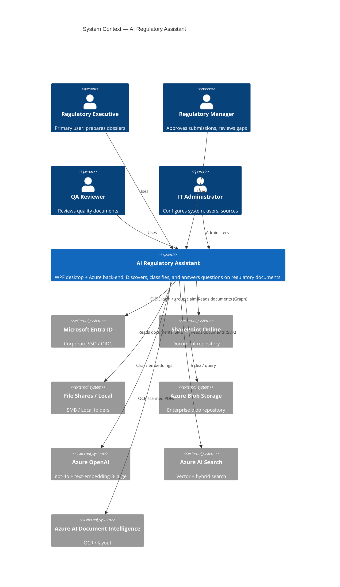

### 2.2 Container View (C4-L2)

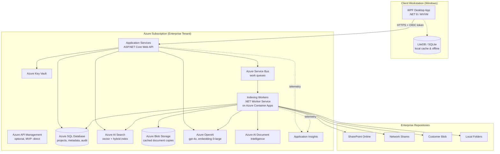

**Rationale for a thin server tier** (see [ADR-002](#adr-002-thin-server-tier-vs-fat-client)): although the BRD specifies an *enterprise desktop application*, MVP still requires (a) shared indexes across users, (b) long-running discovery workers, (c) safe access to Azure OpenAI without embedding API keys in the client, and (d) auditability. A minimal ASP.NET Core Web API + Worker Service satisfies these while keeping the client experience desktop-first (P1).

### 2.3 Deployment View (Summary)

- **Client**: MSIX-packaged WPF app, distributed via Intune or Microsoft Store for Business.
- **Server**: ASP.NET Core Web API on Azure App Service (Linux, P1v3).
- **Workers**: Azure Container Apps with KEDA scale rules on Service Bus queue depth.
- **Data**: Azure SQL DB (General Purpose, Gen5, 4 vCore MVP baseline).
- **Search**: Azure AI Search (Standard S2 tier — required for vector + semantic ranking at MVP scale).
- **AI**: Azure OpenAI (`gpt-4o-mini` or `gpt-4o` chat, `text-embedding-3-large` embeddings) — region: Sweden Central or West Europe for EU data residency.
- **Secrets**: Azure Key Vault, referenced from App Service/Container Apps via Managed Identity.

Full topology in [§11](#11-deployment-architecture).

---

## 3. Logical Architecture — Web Client

> **v1.5 pivot**: The client is a **React 18 + TypeScript SPA** served by an **ASP.NET Core BFF (Backend-for-Frontend)**. The prior WPF design (v1.0–v1.4) is superseded — see ADR-019. All content lives in cloud (SharePoint Online + Azure Blob), so no local-file / SMB access is required, which removes the reason to ship a desktop app.

### 3.1 Tier structure

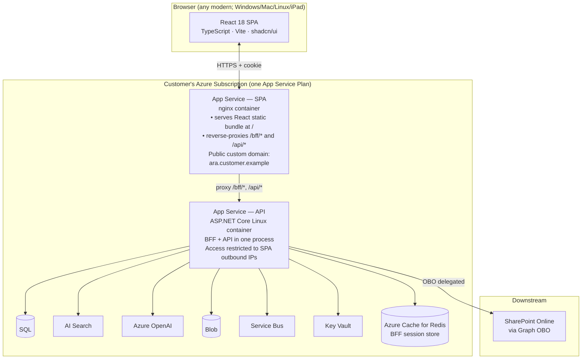

**Why this split:**

- **Frontend and backend deploy independently** — a UI-only change ships without touching the .NET runtime or triggering EF migrations; a backend change ships without invalidating the SPA build hash.
- **BFF and API stay co-located** — they share the same ASP.NET Core process, allowing the BFF to attach access tokens to internal `/api/*` calls **in-process** without another network hop or shared secret. Splitting BFF from API would require an internal auth layer with no compensating benefit.
- **Zero extra infrastructure cost** — both App Services run on the **same App Service Plan** (e.g., a single P1v3 ~$120/month hosts both). The browser sees only the SPA hostname; the SPA's nginx transparently reverse-proxies `/bff/*` and `/api/*` to the API App Service over HTTPS. Cookies are set on the SPA hostname and remain same-origin.
- **API App Service is not directly reachable from the public internet** — App Service access restrictions lock it to accept traffic only from the SPA's outbound IPs (or VNet-integrated private endpoint in Enterprise sizing). Defender for App Service (~$15/instance/month) provides runtime threat protection.
- **Azure Front Door + WAF is an opt-in add-on** — for customers who need global edge caching, managed L7 WAF, or L7 DDoS. Enabled via a Bicep parameter (`enableFrontDoor=true`); adds one Front Door profile and a WAF policy. Default topology omits it — cost delta ~$45–75/month base plus traffic charges is unjustified for a single-region internal RA tool.
- **Alternative for `sizingTier=small`** — replace the SPA App Service with **Azure Static Web Apps** (SWA free tier) linked to the API App Service via SWA "Bring Your Own Backend". SWA has a free tier and built-in edge CDN, but it is a managed platform some pharma customers prefer to avoid. Documented in `/deploy/docs/install-guide.md`.

See ADR-022 for the split-App-Service + nginx-proxy decision.

### 3.2 Technology Choices (Web Client)

| Concern | Choice | Rationale / Alternatives |
|---|---|---|
| Framework | **React 18** + **TypeScript 5.x** | Best AI-UX ecosystem; broad hiring pool; long-term stability. Alternatives: Blazor Server (rejected — persistent WebSocket brittle behind pharma proxies), Vue/Angular (smaller AI ecosystem) |
| Build | **Vite 5** | Fastest DX; ESM-native; small config. Alternative: Next.js (rejected — SSR overhead not needed for internal enterprise app) |
| Component library | **shadcn/ui** on top of **Radix UI** | Owned components in-repo (no black-box); WCAG 2.1 AA baseline; consistent design tokens. Alternatives: MUI, Fluent UI React |
| Styling | **Tailwind CSS** | Design-token discipline; zero-runtime; excellent shadcn integration |
| State — server | **TanStack Query v5** | Declarative caching, background refetch, mutation lifecycle; retire in favour of React 19 server actions later if we adopt Next.js |
| State — client | **Zustand** for cross-page state; component state via hooks | Simpler than Redux; less boilerplate than Recoil |
| Routing | **React Router v7** (data mode) | File-based routing via convention; loaders/actions align with TanStack Query |
| Forms + validation | **React Hook Form** + **Zod** schemas shared with BFF | Single source of truth for validation; SSR-free |
| AI chat streaming | **Vercel AI SDK v3** (`useChat`) over Server-Sent Events | Purpose-built for token streaming + tool calls; see ADR-021 |
| Data grid | **TanStack Table v8** + shadcn primitives | Headless, accessible; heavier grids only if we hit performance ceilings |
| Charts | **Recharts** or **visx** (lazy-loaded) | Small footprint; both a11y-viable |
| Icons | **Lucide React** | Tree-shakeable; consistent style |
| PDF viewer | **@react-pdf-viewer/core** (lazy) | For dossier + gap-report review inline |
| i18n | **react-intl** (FormatJS) | ICU message syntax; en-GB default, extensible per pharma customer |
| Auth | **BFF pattern** — HttpOnly session cookie (SameSite=Strict, Secure); **no MSAL.js** in browser | See ADR-020 |
| HTTP | Native `fetch` + custom `apiClient` wrapper (cookie-only, CSRF header) | No Axios needed |
| Testing (unit) | **Vitest** + **React Testing Library** | Same runner as Vite; jsdom |
| Testing (e2e) | **Playwright** (matrix: Chromium, Edge, WebKit) | Same-team-friendly; supports Entra ID login via `page.request.storageState` after one-off headed login |
| Bundling / a11y check | Vite + **eslint-plugin-jsx-a11y** + Lighthouse CI in pipeline | Fail PRs on regression |
| Package manager | **pnpm** | Faster installs; strict workspaces |

See ADR-019 (React + BFF), ADR-020 (BFF auth), ADR-021 (SSE streaming).

### 3.3 App shell & navigation

```
┌─────────────────────────────────────────────────────────────────┐
│ TopBar   [Logo]  Project switcher  Global search  User chip     │
├────────────┬────────────────────────────────────────────────────┤
│ NavRail    │  <Outlet />                                        │
│  Dashboard │                                                    │
│  Projects  │      React Router loaders fetch page data          │
│  Discovery │      TanStack Query caches by URL key              │
│  Dossiers  │                                                    │
│  Copilot   │      Streaming chat panel docks right in Copilot   │
│  Admin     │                                                    │
└────────────┴────────────────────────────────────────────────────┘
```

- **Route → data** — every route has a `loader` that TanStack Query pre-fills the cache from; components read via `useQuery`.
- **Route-level code splitting** — every page a lazy `import()`; initial bundle < 200 KB gzip target.
- **Persistence** — last-visited project stored in `localStorage`; NavRail collapse state in `localStorage`.
- **Error boundaries** — one per route, plus a global root boundary that captures + logs to App Insights JS SDK.

### 3.4 Runtime configuration

There is **no build-time config** for tenant/API URL. On first paint the SPA calls:

```
GET /bff/config     →  { tenantId, apiBaseUrl (same origin), featureFlags, brandingTokens }
```

BFF derives the response from server-side `appsettings.json` + Key Vault references. The SPA never sees the tenant ID until it fetches it, so the same static bundle serves every customer install — no per-customer bundle rebuild, no first-run wizard, no manual configuration.

### 3.5 Threading & long-running work

Browsers have one UI thread; the design leans on:

- **Web Workers** for expensive client-side work (PDF pre-render, large-grid virtualisation, dossier diff)
- **AbortController** on every fetch — routes that unmount cancel in-flight requests
- **Optimistic updates** via TanStack Query mutation lifecycle
- **Server-Sent Events** (`EventSource`) for Copilot streaming and long-job progress (dossier compile, discovery run)

### 3.6 Accessibility & responsive design

- **WCAG 2.1 AA** baseline; measured in CI via `axe-core` + Lighthouse.
- Keyboard-first — every action reachable without mouse; focus rings always visible.
- Screen-reader tested (NVDA + VoiceOver) for the critical paths: sign-in, project switch, Copilot chat, dossier compile.
- Breakpoints: `sm` 640, `md` 768, `lg` 1024, `xl` 1280, `2xl` 1536. Full workflows must function ≥ `md`; RA laptop is typically 1440×900+.
- Print-friendly stylesheets for gap reports and manifests.

### 3.7 Offline & connectivity

The web client is **online-only** (per BYOC + BFF pattern). Graceful degradation:

- Service Worker caches static bundle for fast reload; **does not** cache API responses.
- Network-loss banner + "Reconnect" affordance.
- Copilot chat draft persists in `sessionStorage` and resends after reconnect.

### 3.8 What was removed vs v1.4

- WPF project (`ARA.Client.Wpf`) — deleted
- MSIX packaging + Intune distribution — deleted
- MSAL.NET WAM broker — deleted (replaced by BFF OpenID Connect flow, see §4.1)
- CommunityToolkit.Mvvm, LiteDB, Refit, Syncfusion — deleted
- First-run configuration wizard — deleted (replaced by §3.4 runtime config)
- Client-side offline cache — deleted

---

## 4. Component Design — Functional Modules

Each module below maps 1:1 to a BRD module (§20).

### 4.1 Module 1 — Authentication & User Management

**Requirements**: FR-001, FR-002, FR-003 · NFR-016, NFR-017.

> **v1.5 pivot**: This module is now realised via the **BFF (Backend-for-Frontend)** pattern. The browser never handles access tokens; it holds only an HttpOnly session cookie. All Entra ID interactions happen server-side in the BFF. See ADR-020.

**Server components (`ARA.Bff` — same App Service and same process as `ARA.Api`; the SPA App Service reverse-proxies `/bff/*` from the browser — see ADR-022)**

- **OpenID Connect + Cookie authentication**
  - `AddMicrosoftIdentityWebApp` — server-side auth-code + PKCE flow with Entra ID
  - `AddMicrosoftIdentityWebApi` — validates JWTs on `/api/*`
  - `AddSessionTokenCaches()` — access + refresh tokens stored server-side (in-memory for single-instance dev; distributed cache — Azure Cache for Redis — for multi-instance prod, see §3.1)

- **Session cookie**
  - Name: `aspnet.ara.session`
  - `HttpOnly=true` — inaccessible to JavaScript
  - `Secure=true` — HTTPS-only
  - `SameSite=Strict` — CSRF baseline
  - Sliding expiry: 30 min inactivity; absolute expiry: 8 hours; forced re-auth on absolute expiry
  - Encrypted with Data Protection keys stored in Key Vault (rotation supported)

- **CSRF defence** — double-submit anti-forgery: BFF issues a non-HttpOnly `X-CSRF-Token` cookie on login; SPA reads it and sends it as `X-CSRF-Token` header on every mutating request. BFF validates match on `POST/PUT/PATCH/DELETE`.

- **Endpoints on `/bff/*`**
  - `GET  /bff/login`   — redirects to Entra ID authorize endpoint
  - `GET  /bff/callback`— Entra redirects here; BFF exchanges code, sets cookie
  - `POST /bff/logout`  — clears session + Entra signout
  - `GET  /bff/user`    — returns current profile + roles (SPA calls on mount)
  - `GET  /bff/config`  — bootstrap config for the SPA (§3.4)

**Client components (`ARA.Web` — React SPA)**

- `AuthProvider` React context — calls `GET /bff/user` on mount; if `401`, redirects to `/bff/login`
- `useAuth()` hook — exposes `{ user, roles, isAuthenticated, signOut }` to components
- `apiClient` — a thin `fetch` wrapper that: (a) always sends `credentials: 'include'` for the cookie; (b) attaches `X-CSRF-Token` header on non-GET; (c) treats `401` as "session expired" → redirect to `/bff/login`
- No MSAL.js, no token storage, no session storage of secrets

**Server — API authorisation**

- Downstream `/api/*` calls carry the cookie; BFF middleware translates cookie → in-memory access token from token cache → attaches `Authorization: Bearer` to internal handlers
- `[Authorize(Policy = "RegulatoryExecutive")]` policies bind to App Roles emitted in the `roles` claim (see §11 BYOC: App Roles are tenant-agnostic)
- `Sites.Read.All`, `Files.Read.All` for downstream Graph / SharePoint Online access via **On-Behalf-Of** flow (`AcquireTokenOnBehalfOf`) using the cached user token

**Configuration**

```jsonc
"AzureAd": {
  "Instance":        "https://login.microsoftonline.com/",
  "TenantId":        "<customer-tenant-id>",       // set from parameters.<env>.json
  "ClientId":        "<bff-client-id>",             // ARA-Bff app registration
  "ClientCredentials": [ { "SourceType": "KeyVault", "KeyVaultUrl": "<kv-uri>", "KeyVaultCertificateName": "ara-bff-cert" } ],
  "CallbackPath":    "/bff/callback",
  "SignedOutCallbackPath": "/bff/signout-callback",
  "Scopes":          "api://<api-client-id>/access_as_user"
},
"DownstreamApi": {
  "Graph":       { "BaseUrl": "https://graph.microsoft.com/v1.0", "Scopes": "User.Read Sites.Read.All Files.Read.All GroupMember.Read.All" },
  "SharePoint":  { "Scopes": "https://<tenant>.sharepoint.com/AllSites.Read" }
},
"SessionCookie": {
  "Name": "aspnet.ara.session",
  "SlidingExpirationMinutes": 30,
  "AbsoluteExpirationHours":  8
}
```

**Sequence — Sign-in (BFF auth-code + PKCE)**

```mermaid
sequenceDiagram
    actor U as User
    participant B as Browser (SPA)
    participant BFF as ARA BFF
    participant Entra
    participant API as ARA API (same process)

    U->>B: Navigate to https://ara.customer.example
    B->>BFF: GET / (SPA bundle)
    BFF-->>B: HTML+JS
    B->>BFF: GET /bff/user
    BFF-->>B: 401 Unauthorized
    B->>BFF: GET /bff/login
    BFF-->>B: 302 → Entra /authorize (with PKCE challenge)
    B->>Entra: OAuth2 / OIDC
    Entra-->>B: 302 → /bff/callback?code=...
    B->>BFF: GET /bff/callback?code=...
    BFF->>Entra: POST /token (code + verifier + client cert)
    Entra-->>BFF: id_token + access_token + refresh_token
    BFF->>BFF: Store tokens in server session cache
    BFF-->>B: 302 → / + Set-Cookie: aspnet.ara.session=...; HttpOnly; Secure; SameSite=Strict
    B->>BFF: GET /bff/user (with cookie)
    BFF-->>B: { name, email, roles: [ RegulatoryExecutive ] }
    B->>B: Render dashboard
    B->>BFF: GET /api/projects (cookie + X-CSRF-Token)
    BFF->>API: internal call (access token attached)
    API->>API: Validate + authorize
    API-->>B: 200 + project list
```

**Sequence — Downstream SharePoint access (OBO)**

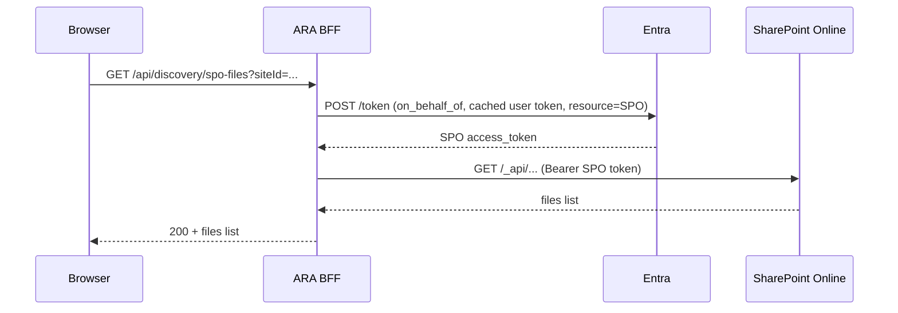

**Acceptance mapping**: AC-001..AC-004 verified by Playwright end-to-end tests against a Microsoft 365 developer tenant using headed sign-in once, then `storageState` reuse for the rest of the suite.

### 4.2 Module 2 — Project Management

**Requirements**: FR-004 (create), FR-005 (edit), FR-006 (archive).

**Domain model**
```csharp
public class Project {
    public Guid Id { get; init; }
    public string Name { get; set; }        // unique per tenant
    public ProjectStatus Status { get; set; } // Draft, Active, Archived
    public Product Product { get; set; }
    public string Country { get; set; }     // EU only in MVP
    public SubmissionProcedure Procedure { get; set; }
    public string Applicant { get; set; }
    public string? Description { get; set; }
    public DateTimeOffset CreatedUtc { get; init; }
    public string CreatedBy { get; init; }
    public bool DiscoveryStarted { get; set; }
}

public class Product {
    public string Name { get; set; }        // immutable after DiscoveryStarted (FR-005)
    public string GenericName { get; set; }
    public string Strength { get; set; }
    public string DosageForm { get; set; }
}
```

**Application services**
- `CreateProjectHandler` (MediatR) — validates uniqueness, defaults status=Draft.
- `EditProjectHandler` — enforces field-level rules (FR-005).
- `ArchiveProjectHandler` — soft-delete, sets `Status=Archived`; project remains searchable read-only.

**Business rules**
- Project name unique within tenant → enforced by unique index (§6.2).
- Country = EU only in MVP (enforced by enum + FluentValidation rule).
- Once `DiscoveryStarted=true`, `Product.Name` is read-only.

### 4.3 Module 3 — Requirement Engine (CTD Template Driven)

**Requirements**: FR-007, FR-008 · P5 (config-driven) · ADR-013.

> **Design shift (v1.1):** Regulatory requirements are no longer derived from a hand-authored SQL rules table. They are derived from a **CTD Dossier Template document** — a versioned artifact (Word or structured YAML) that defines the complete CTD hierarchy (Modules 1–5, submodules, subsections) and the expected content slot for each node. The Requirement Engine parses this template and projects it as the requirement checklist. Gap Analysis and CTD Mapping (§4.7, §4.8) consume the same template — one source of truth for structure, expectations, and arrangement.

#### 4.3.1 Concept — What is a CTD Dossier Template?

A CTD Dossier Template is a first-class business artifact managed by Regulatory Affairs. It captures:

1. **Regulatory scope** — Country/Region (EU), Procedure (Centralised, MRP/DCP, National), Product type (Small Molecule, Biologic, Generic, Variation Type IA/IB/II, etc.).
2. **Full CTD hierarchy** — every Module, submodule and section down to leaf level, with the exact ordering and titles that the final dossier must follow.
3. **Expected content per leaf** — for each leaf node the template declares one or more *content slots* describing what document(s) belong there (name, description, mandatory flag, expected filename patterns, expected AI classification categories, accepted file types, and free-text guidance for the RA user).
4. **Folder convention** — the canonical folder-name for each node inside the customer's source repository, so the discovery engine knows where to look.

Multiple templates coexist. A project binds to exactly **one template version** at creation time (locked, see ADR-012). Admins upload new templates or new versions of existing templates via the Admin UI (FR-030).

#### 4.3.2 Template Format

Two representations are supported and are round-trippable:

- **Word template (`.docx`)** — Regulatory Affairs authors prefer Word. A predefined style set (`ARA-CTD-Module`, `ARA-CTD-Section`, `ARA-CTD-Slot`) plus a two-column table for slot attributes gives the parser deterministic hooks.
- **YAML manifest (`.yaml`)** — the machine-readable form generated from the Word template (or authored directly by advanced users). This is the form the system executes against.

Illustrative YAML:

```yaml
template:
  id: EU-CTD-SmallMolecule-Centralised
  version: 2026.07.01
  region: EU
  procedure: Centralised
  productType: SmallMolecule
  folderConvention: Numeric      # or 'Descriptive' | 'Custom'

nodes:
  - id: M1
    title: "Module 1 — Administrative Information"
    folder: "Module 1"
    children:
      - id: 1.2
        title: "Application Form"
        folder: "1.2 Application Form"
        slots:
          - key: APPLICATION_FORM
            name: "EU Application Form"
            description: "Signed EMA application form for centralised procedure"
            mandatory: true
            expectedTypes: [pdf, docx]
            filenamePatterns: ["*application*form*", "*EMA-Form*"]
            expectedClassifications: [ApplicationForm]

  - id: M3
    title: "Module 3 — Quality"
    folder: "Module 3"
    children:
      - id: 3.2.P
        title: "Drug Product"
        folder: "3.2.P Drug Product"
        children:
          - id: 3.2.P.8
            title: "Stability"
            folder: "3.2.P.8 Stability"
            slots:
              - key: STABILITY_LONG_TERM
                name: "Long-Term Stability Report"
                mandatory: true
                expectedTypes: [pdf, docx]
                filenamePatterns: ["*long*term*stability*", "*LTS*"]
                expectedClassifications: [StabilityReport]
                guidance: "24-month data at 25°C/60%RH per ICH Q1A(R2)"
              - key: STABILITY_ACCELERATED
                name: "Accelerated Stability Report"
                mandatory: true
                expectedClassifications: [StabilityReport]
                filenamePatterns: ["*accelerated*stability*", "*40C*75RH*"]

  - id: M4
    title: "Module 4 — Non-Clinical Study Reports (Reference)"
    referenceOnly: true
    folder: "Module 4"
  - id: M5
    title: "Module 5 — Clinical Study Reports (Reference)"
    referenceOnly: true
    folder: "Module 5"
```

Nodes can nest arbitrarily deep to reflect the actual CTD granularity. `referenceOnly` nodes are shown in the arranged dossier but are not gap-analyzed in MVP (BRD scope for Modules 4/5).

#### 4.3.3 Components

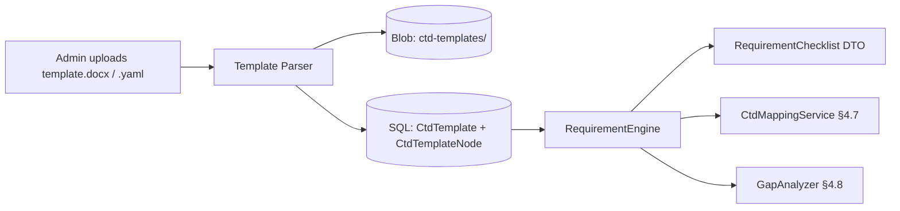

- `ICtdTemplateParser` — parses `.docx` (OpenXML SDK) or `.yaml` (YamlDotNet) into `CtdTemplate`.
- `CtdTemplateStore` — persists the parsed template (SQL for structure/queries + Blob for the raw original for provenance).
- `RequirementEngine.GetChecklist(projectId)` — resolves the project's locked template version and returns the flattened checklist of *slots* with status placeholders.

**Performance** (FR-008): checklist generation ≤ 5 s — templates cached in `IMemoryCache` (30-min sliding); typical template has ~500 nodes, well within budget.

**Extension** (FR-030): admins can add/edit templates through the Admin UI; every save creates a new immutable version. Existing projects continue on their locked version; an explicit "Migrate to template vX.Y.Z" action is available with a delta preview.

#### 4.3.4 Template Provisioning — Catalog & Storage Layout

Templates are not created from thin air per tenant. The system ships with a **CTD Template Catalog** — a curated set of default templates for each supported country/region, hosted in a dedicated Azure Storage account and versioned centrally. Tenants and projects can override these defaults when the standard doesn't fit.

**Three-tier storage**

```
┌─────────────────────────────────────────────────────────────┐
│  System Template Catalog  (Storage Account: stara-catalog)   │
│  Managed by Product Team, read-only from tenants            │
│                                                              │
│  containers/ctd-catalog/                                     │
│    region/EU/                                                │
│      centralised/small-molecule/2026.07.01/template.docx     │
│      centralised/small-molecule/2026.07.01/template.yaml     │
│      centralised/biologic/2026.05.01/template.docx           │
│    region/US/                                                │
│      standard/small-molecule/2026.06.01/template.docx        │
│    country/DE/                                               │
│      national/small-molecule/2026.04.10/template.docx        │
│    country/FR/                                               │
│      national/small-molecule/2026.04.15/template.docx        │
│    index.json     ← machine-readable catalog manifest        │
└─────────────────────────────────────────────────────────────┘

┌─────────────────────────────────────────────────────────────┐
│  Tenant Overrides  (Storage Account: stara-tenant)           │
│  Uploaded by tenant admins for their organisation           │
│                                                              │
│  containers/ctd-tenant/{tenantId}/                           │
│    country/DE/national/small-molecule/2026.07.02/            │
│      template.docx                                           │
│      template.yaml                                           │
│      upload-metadata.json                                    │
└─────────────────────────────────────────────────────────────┘

┌─────────────────────────────────────────────────────────────┐
│  Project Overrides  (same account, per-project container)    │
│  Uploaded by RA users for a specific project only           │
│                                                              │
│  containers/ctd-project/{tenantId}/{projectId}/              │
│    template.docx                                             │
│    template.yaml                                             │
└─────────────────────────────────────────────────────────────┘
```

**Storage design rules**
- One storage account for system catalog (globally read-only via managed identity + private endpoint), one for tenant/project uploads. Blob soft-delete + versioning enabled on both.
- Files are content-addressed by SHA-256 stored in `CtdTemplateCatalogEntry.ContentHash` — this is what enables **reusability** (see below). The blob path is human-friendly; the hash is the identity.
- All uploads are virus-scanned (Defender for Storage) and schema-validated (parsed → YAML → validated against `ctd-template-schema.json`) before being marked `Available`.

#### 4.3.5 Reusability — Physical Copy Sharing Across Countries

Many countries follow the same template (e.g., EU centralised submissions share one template across all 27 member states; countries following ICH may reuse ICH baseline). Duplicating the same file per country wastes storage and — more importantly — creates divergence risk.

**Design**: the catalog treats templates as **content-addressed artifacts** with **many-to-many country mappings**.

- `CtdTemplateCatalogEntry` represents *one* template file (one hash, one blob URI).
- `CtdTemplateCountryMap` associates that entry with **N countries** (or a whole region).
- When a project asks "give me the EU-Centralised-SmallMolecule template", the resolver returns the single shared entry — no copy is made.

Example:
| CatalogEntry.Id | ContentHash | Region | Countries covered |
|---|---|---|---|
| `EU-CENTR-SM-2026.07.01` | `sha256:8fa2…` | EU | BE, DE, DK, ES, FR, IT, NL, … (all EU-27) |
| `DE-NAT-SM-2026.04.10` | `sha256:1c9e…` | EU | DE (national procedure only) |
| `FR-NAT-SM-2026.04.15` | `sha256:aa77…` | EU | FR (national procedure only) |

DE therefore has two templates available (`EU-CENTR-SM` for centralised submissions, `DE-NAT-SM` for German national) and the resolver picks based on `Procedure`.

#### 4.3.6 Resolution Order

When a project is created, the system resolves the applicable template using the following **priority chain** (first match wins). Every resolution step is audit-logged so RA teams can prove which template governed the submission.

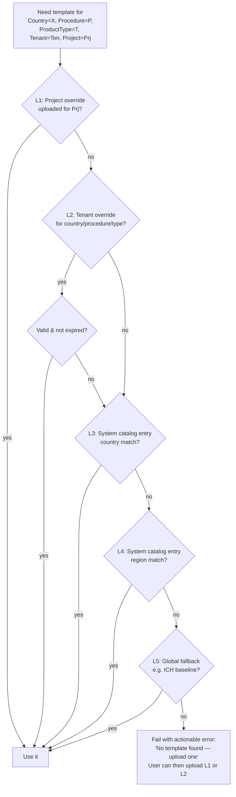

**Validity check on L2**: tenant overrides carry `EffectiveFrom` and optional `EffectiveTo`. If the override has an expiry and it has passed, the system falls through to L3.

**Freshness signalling**: whenever the system catalog gets a newer version than the one a tenant/project is on, an in-app notification is raised. Migration is never forced — the RA team decides.

#### 4.3.7 User Upload Flow (Override)

Reached from either Admin → CTD Templates (tenant scope) or a Project → Settings → Template tab (project scope).

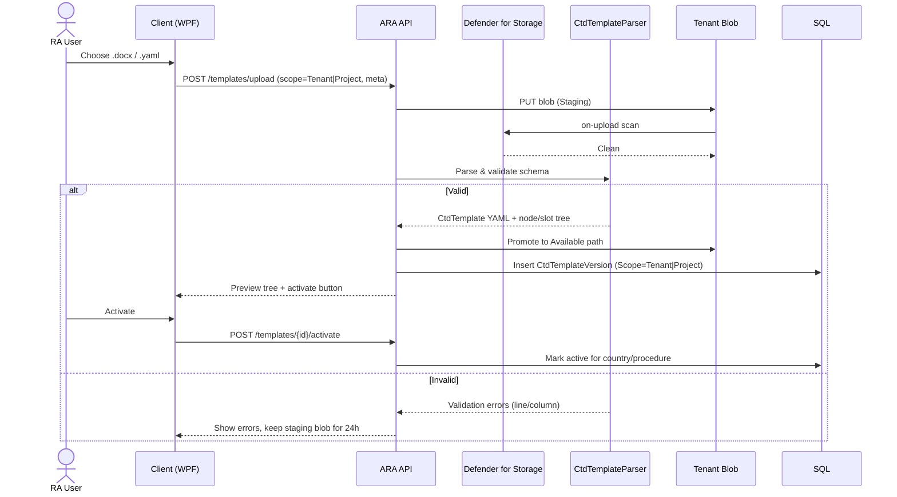

**Guardrails**
- Only users with `Administrator` role may upload tenant-scope templates. Any authenticated user with project-edit rights may upload a project-scope template.
- Every upload is virus-scanned, schema-validated, and structurally diffed against the previous active version so the reviewer sees added/removed/changed nodes and slots before activating.
- A tenant override supersedes the catalog **only** for the tenant that uploaded it. Cross-tenant leakage is prevented by RLS and per-tenant blob container ACLs.

#### 4.3.8 Country → Storage Location Mapping (Requested Table)

The catalog is self-describing via `index.json`, but a normalised SQL projection is maintained for fast querying and for the resolver's L3/L4 steps. It also holds the `many-countries → one template` map (§4.3.5) plus the tenant location overrides.

See §6.2 for the full DDL — the key tables are:
- `Country` — ISO code, region code, active flag.
- `Region` — region code, description (EU, US, APAC, etc.).
- `CtdTemplateCatalogEntry` — one row per system catalog template (hash-identified).
- `CtdTemplateCountryMap` — many-to-many mapping of a catalog entry to countries (or a region wildcard).
- `CtdTemplateStorageBinding` — resolves *where* to fetch the template bytes for a given catalog entry / tenant override (storage account URI + container + blob path).

This makes it possible, for example, to move the EU catalog from `stara-catalog` to `stara-catalog-eu2` (different region for data residency) with a single row update in `CtdTemplateStorageBinding`, without touching any tenant configuration.

### 4.4 Module 4 — Document Source Configuration

**Requirements**: FR-009, FR-010 · P2.

**Connector plug-in contract**
```csharp
public interface IRepositoryConnector {
    RepositoryType Type { get; }
    Task<ConnectionTestResult> TestAsync(RepositoryConfig cfg, CancellationToken ct);
    IAsyncEnumerable<DiscoveredFile> EnumerateAsync(RepositoryConfig cfg, DiscoveryFilter filter, CancellationToken ct);
    Task<Stream> OpenReadAsync(DiscoveredFile file, CancellationToken ct);
    Task<DocumentMetadata> GetMetadataAsync(DiscoveredFile file, CancellationToken ct);
}
```

**Concrete connectors (MVP)**
| Connector | Auth model | Notes |
|---|---|---|
| `LocalFolderConnector` | OS ACLs | Runs client-side only (files never uploaded raw to cloud unless indexing worker mounts them). See §7.5 for on-prem worker option. |
| `NetworkShareConnector` | Windows integrated | Same as above. |
| `SharePointOnlineConnector` | Delegated Graph token (OBO flow) | Uses `sites/{id}/drive/root/children` recursively. |
| `AzureBlobConnector` | Managed Identity + user's Entra RBAC on storage account | Uses `BlobContainerClient` with `TokenCredential`. |

Repositories are configured per-project and persisted in `RepositoryConfig` table.

**Connection test** (FR-010): performs (a) path/permission check, (b) list first N items, (c) round-trip in ≤ 10 s.

### 4.5 Module 5 — Document Discovery & OCR

**Requirements**: FR-011, FR-012, FR-013 · NFR-005, NFR-006.

The system supports **two discovery modes**, chosen per project. The default for template-driven projects is **Template-Guided** — it directly reflects your intent: walk the CTD template, then look in the configured source locations for the folder that matches each module/submodule, and pull content from there. The **Broad Scan** mode remains available for messy source layouts that don't follow CTD folders.

#### 4.5.1 Mode A — Template-Guided Discovery (default)

The pipeline is driven by the resolved template (§4.3.6): for each leaf node in the template it computes an expected folder path in every configured source, tries to find it (with alias tolerance), and enumerates only that folder's contents.

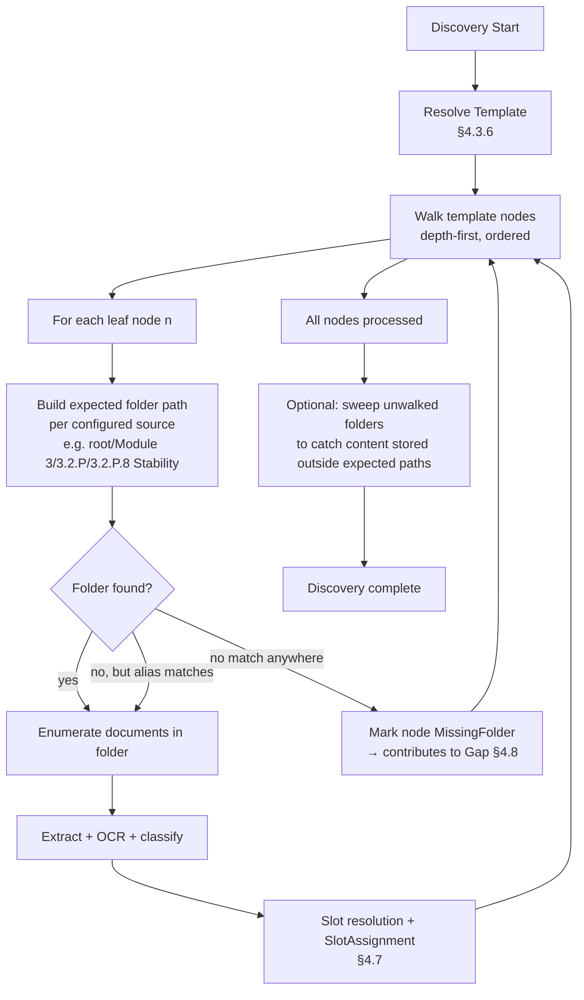

Key characteristics:
- **Deterministic and traceable** — every source path enumerated is derivable from a template node.
- **Efficient** — avoids scanning irrelevant subtrees (e.g., archived batches folders unrelated to the current dossier).
- **Missing folder = signal** — a template node whose folder cannot be found in any configured source raises a `MissingFolder` anomaly which the Gap Analysis reports as a **structural gap** (all slots under that node are `Missing`).
- **Aliases honoured** — template nodes' `aliases` (`M3`, `Drug Product`, `Stability`, `stab`) provide tolerance for legacy naming.
- **Multi-source** — if a project configures more than one source (e.g., SharePoint + a Network Share), each is walked in parallel; a slot may be filled from any source. Precedence rules (e.g., "prefer SharePoint over Network Share") are configurable per project.
- **Optional sweep pass** — a final broad scan (subject to size limits) picks up content that lives *outside* the expected template folders (e.g., under `misc/`), classifies it, and either assigns it to a slot via §4.7's non-folder signals (S2 filename + S3 classification) or lands it under `Unassigned`.

Pseudocode:

```csharp
async Task RunTemplateGuidedAsync(Project project, CancellationToken ct) {
    var template = await _resolver.ResolveTemplateAsync(project, ct);
    foreach (var node in template.LeafNodesInOrder()) {
        foreach (var source in project.Sources) {
            var folder = ResolveExpectedPath(source, node);
            var connector = _connectorFactory.For(source.Type);
            var hit = await connector.TryFindFolderAsync(folder, node.Aliases, ct);
            if (hit is null) {
                await _anomalies.RaiseAsync(new MissingFolder(node.Id, source.Id), ct);
                continue;
            }
            await foreach (var file in connector.EnumerateAsync(hit, ct)) {
                await _processing.EnqueueAsync(file, hintedNodeId: node.Id, ct);
            }
        }
    }
    if (project.SweepUnwalkedFolders)
        await _sweep.RunAsync(project, ct);
}
```

The `hintedNodeId` becomes signal S1 (folder-path evidence with weight 1.0 since it was intentional, not inferred) in the slot resolver (§4.7.1), so template-guided discovery yields nearly deterministic assignments.

#### 4.5.2 Mode B — Broad Scan (fallback)

Used when source folders don't follow CTD conventions. Behaviour is the original design: recursively scan everything, extract, classify, and let §4.7's multi-signal resolver do the work. Slower and less certain, but tolerant of arbitrary layouts.

Both modes share the same per-document processing steps (Extract → OCR → Classify → SlotResolve → Index). Only the enumeration strategy differs.

#### 4.5.3 Common — Metadata Extraction & OCR

- **Metadata extraction** (FR-012): file name, size, dates, author, department, document number, version (extracted from file properties + first-page heuristics).
- **OCR** (FR-013): scanned PDFs routed to Azure Document Intelligence `prebuilt-read`; layout model for tabular content (specifications, CoAs).

Full pipeline design (state machine, throughput, resumability) in [§8](#8-discovery--indexing-pipeline).

### 4.6 Module 6 — AI Document Classification

**Requirements**: FR-014, FR-015, FR-016.

**Approach**: Hybrid classifier — deterministic pre-classification via filename + keyword rules, refined by LLM prompt classification for ambiguous cases.

**Categories** (BRD §Module 6, extendable via admin):
`StabilityReport`, `AnalyticalMethodValidation`, `CleaningValidation`, `ProcessValidation`, `Specification`, `RiskAssessment`, `BatchAnalysis`, `CertificateOfAnalysis`, `ManufacturingProcess`, `PackagingSpecification`, `Unknown`.

**Deterministic rules (fast path)**
- Regex + weighted keyword scoring on filename and first 2 pages of extracted text.
- If top-score confidence ≥ 0.85 → use deterministic result and skip LLM.

**LLM path (ambiguous)**
- Prompt template: system message anchors the model as an EU regulatory classifier, provides the category taxonomy and one-line definitions, and asks for JSON output.
- Input: first N pages of extracted text (up to ~4k tokens) + filename + folder path.
- Response schema (function calling / structured outputs):
```json
{
  "category": "StabilityReport",
  "confidence": 0.93,
  "reasoning": "Document discusses long-term stability at 25°C/60%RH for 24 months...",
  "alternate_categories": [{"category":"BatchAnalysis","confidence":0.05}]
}
```
- Model: `gpt-4o-mini` by default (cost/latency), configurable to `gpt-4o` for higher-stakes projects (FR-031).

**Confidence score** (FR-015) is persisted with every classification. Values below a configurable threshold (default 0.75) flag the document for manual review in the UI.

**Manual override** (FR-016): user selects a different category; system records `Classification.Override = true`, original AI category, new category, user id, timestamp — full audit trail.

**Accuracy target**: ≥ 90% (FR-014). Measured via a labelled fixture set (≥ 500 documents) executed in nightly regression.

### 4.7 Module 7 — CTD Mapping & Dossier Arrangement (Template-Driven)

**Requirements**: FR-017, FR-018 · ADR-013.

> **Design shift (v1.1):** Mapping is no longer a `Classification → CTD section` lookup table. The system uses the project's bound **CTD Dossier Template** (§4.3) as the target structure and *arranges* discovered content into the template's slots. The result is an "Arranged Dossier" — a live tree that mirrors the template hierarchy, populated with the actual documents found under the configured source location.

#### 4.7.1 Mapping Strategy — Signal Precedence

For every discovered document the system computes a candidate template slot using a **weighted, multi-signal resolver**. Signals, in decreasing weight:

| # | Signal | Weight | Rationale |
|---|---|---|---|
| S1 | **Source folder path** matches template folder convention (e.g., `.../Module 3/3.2.P/3.2.P.8 Stability/LTS_Batch24-002.pdf`) | 0.50 | Users already organise dossiers by module folders — this is the strongest, most reliable signal. |
| S2 | **Filename pattern** matches a slot's `filenamePatterns` | 0.20 | Naming conventions are common in RA teams. |
| S3 | **AI Classification** category matches slot's `expectedClassifications` | 0.20 | Semantic evidence — powerful when folders are flat or misnamed. |
| S4 | **LLM slot-disambiguation** (see §5.3) applied only when the top-two candidate slots score within 0.10 of each other | 0.10 | Costly, used sparingly. |

The resolver produces an ordered list of `SlotCandidate { slotKey, score, signals[] }`. The top candidate becomes the assignment; ties or low top-score (`< 0.55`) trigger `Status = NeedsReview` (FR-018).

#### 4.7.2 Folder Convention & Path Matcher

The template declares a `folderConvention` (`Numeric | Descriptive | Custom`) plus a `folder` name per node. The path matcher walks a document's source path bottom-up and finds the deepest node whose folder segment matches (case-insensitive, whitespace-normalised, tolerant of prefixes like "1.2 ", "1.2-", "1_2_").

Examples:
| Source path | Matched node |
|---|---|
| `.../Atorvastatin/Module 3/3.2.P/3.2.P.8 Stability/LTS.pdf` | `3.2.P.8 Stability` |
| `.../Atorvastatin/M3/Drug Product/Stability/LTS.pdf` | `3.2.P.8 Stability` (via alias resolution — see below) |
| `.../shared/reports/LTS_Atorvastatin.pdf` | *(no folder hit — falls back to S2/S3)* |

**Aliases**: template nodes carry an optional `aliases: [...]` list to cover legacy naming (`M3`, `Drug Product`, `Stability`, etc.). Admins maintain aliases in the template.

#### 4.7.3 Dossier Arrangement Service

`IDossierArrangementService` produces the arranged view for a project:

```csharp
public interface IDossierArrangementService {
    Task<ArrangedDossier> ArrangeAsync(Guid projectId, CancellationToken ct);
}

public sealed record ArrangedDossier(
    Guid ProjectId,
    string TemplateId,
    string TemplateVersion,
    IReadOnlyList<ArrangedNode> Modules,      // M1..M5 in template order
    IReadOnlyList<UnassignedItem> Unassigned  // docs that matched no slot
);

public sealed record ArrangedNode(
    string NodeId, string Title, string FolderPath,
    IReadOnlyList<ArrangedNode> Children,
    IReadOnlyList<SlotAssignment> Slots,
    NodeStatus Status                          // Complete | Partial | Missing | NeedsReview
);

public sealed record SlotAssignment(
    string SlotKey, string SlotName, bool Mandatory,
    Document? Primary,                         // best candidate, latest version
    IReadOnlyList<Document> Alternatives,      // older versions / duplicates
    IReadOnlyList<SignalScore> Evidence,       // explains the assignment
    SlotStatus Status                          // Assigned | Missing | Duplicate | Expired | NeedsReview
);
```

The arranged tree preserves the template order exactly — the client can render it as the "dossier as it will look at submission time."

#### 4.7.4 Discovery-Time vs. Query-Time Arrangement

- **Discovery-time** — When a document is indexed, its assignment (top candidate + evidence) is persisted in `SlotAssignment`. This keeps arrangement O(1) at read.
- **Query-time re-arrangement** — Triggered when: (a) the template is upgraded, (b) an admin edits aliases, or (c) an RA user manually overrides an assignment. A background job re-runs the resolver over affected documents.

#### 4.7.5 Manual Override

RA users can:
- **Reassign** a document to a different slot (drag-and-drop in the Arranged Dossier view or Document Explorer). Recorded with actor + timestamp + reason.
- **Pin** a specific version as the primary (rather than the latest by effective date).
- **Suppress** a document from the dossier (e.g., duplicate scanned copy).

All overrides are audit-logged and take precedence over the automatic resolver on subsequent runs (unless the user explicitly resets).

#### 4.7.6 Validation & Anomalies (FR-018)

The mapping service surfaces:
- **Unknown/unassigned** — document has no candidate slot with score ≥ threshold. Displayed under `Unassigned` with suggested slots.
- **Multiple mappings** — two slots score within tolerance. `NeedsReview`; UI presents both with evidence for the user to pick.
- **Cross-module conflict** — folder says Module 3 but classification and content strongly suggest Module 2 (Summaries). Flagged for review.
- **Template drift** — folders exist in the source that don't match any template node (e.g., `Module 6`). Reported as `UnknownFolder` anomalies so admins can extend the template or clean up the source.

#### 4.7.7 Sequence — Arrangement on Discovery

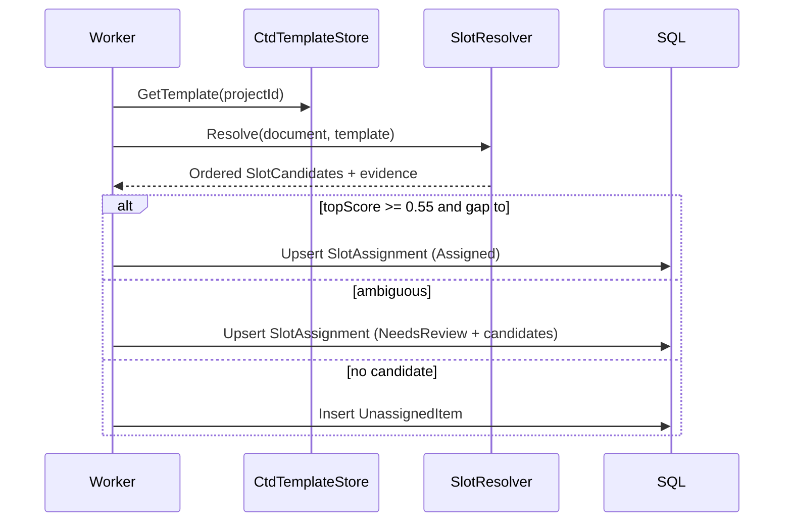

### 4.8 Module 8 — Gap Analysis (Template-Driven)

**Requirements**: FR-019, FR-020, FR-021 · NFR-007 · ADR-013.

Gap Analysis consumes the **Arranged Dossier** produced by §4.7 and evaluates every slot defined in the CTD template.

**Algorithm**
```
input: ArrangedDossier A (from template T)
for each leaf node n in A:
    for each slot s in n.slots:
        if s.Primary is null:
            s.Status = s.Mandatory ? Missing : Optional-Missing
        else:
            s.Status = Complete
            if s.Alternatives.Any(a => a.ContentHash == s.Primary.ContentHash):
                add Duplicate flag
            if s.Alternatives.Any(a => a.Version > s.Primary.Version):
                add VersionConflict flag
            if s.Primary.EffectiveDate + retention < today:
                add Expired flag
    n.Status = derive(n.slots)   // Complete | Partial | Missing | NeedsReview
propagate n.Status up the tree
```

`UnknownFolder` and `Unassigned` items appear as a separate "Anomalies" panel — they do not count as *missing* (they are the opposite: present-but-unclassified) but are surfaced prominently because they usually indicate template drift or misfiled content.

**Data structures**
- `GapAnalysisRun` — header (project, template id + version, timestamp, actor, KPIs).
- `GapAnalysisNode` — one row per template node with status + counters.
- `GapAnalysisSlot` — one row per template slot with its assignment, status flags, and reason codes.

**Performance** (NFR-007, ≤ 30 s for 20 k documents): because arrangement is materialised at discovery time, gap analysis is a **single SQL projection** over `SlotAssignment` + `CtdTemplateNode` joined to the run's template version. Benchmarked at ~1.5 s for 20 k docs / ~500-node templates on a 4 vCore Azure SQL.

**Dashboard KPIs** (FR-020): Total Slots, Assigned, Missing (Mandatory), Missing (Optional), Duplicates, Expired, NeedsReview, Completion % — computed per Module and rolled up.

**Missing Document Report** (FR-021): Word/PDF export of the `Missing` slice with columns Module · Section · Slot · Guidance · Mandatory · Criticality · Notes.

### 4.9 Module 9 — Regulatory Copilot (RAG)

**Requirements**: FR-022, FR-023, FR-024, FR-025 · NFR-008 (≤ 15 s p95).

See detailed design in [§5.4](#54-rag-pipeline-regulatory-copilot).

**Interface summary**
- `POST /api/projects/{id}/copilot/ask` with body `{ "question": "...", "conversationId": "..." }`.
- Response streams via server-sent events (SSE) so the WPF UI shows tokens as they arrive.
- Response envelope:
```json
{
  "answer": "...",
  "citations": [
    {"documentId":"...", "title":"Stability Report Batch 24-002", "page": 5, "snippet":"...", "score": 0.87}
  ],
  "confidence": "High|Medium|Low",
  "relatedDocuments": [ "docId1", "docId2" ]
}
```

### 4.10 Module 10 — Reporting

**Requirements**: FR-026 (Gap Analysis), FR-027 (Inventory), FR-028 (Audit).

**Design**
- Uses **OpenXML SDK** for `.docx` generation and **QuestPDF** (Community License) for `.pdf` — both allow deterministic templating and are cross-platform (worker runs on Linux containers).
- Templates live in Blob container `report-templates/` and are versioned.
- Reports are generated server-side, uploaded to `report-outputs/{projectId}/{runId}/`, and the client downloads with a SAS URL (delegation SAS, 15-minute TTL).

**Report structure — Gap Analysis (Word)**
1. Cover page (project, product, run timestamp, user)
2. Executive summary (KPIs)
3. Requirement coverage per CTD module
4. Missing documents table
5. Duplicates & version conflicts
6. Expired documents
7. Appendix: full requirement × document matrix

### 4.11 Module 11 — Administration

**Requirements**: FR-029, FR-030, FR-031.

**Areas**
- **Users** — read-only view of users who have signed in; role changes performed in Entra ID (single source of truth). Local override table permits disabling a user faster than propagation.
- **Requirements** — CRUD over the CTD Dossier Templates (§4.3). Admins upload `.docx` or `.yaml`, preview the parsed hierarchy, and publish a new immutable version. Existing projects continue on their locked version; a "Migrate to vX.Y.Z" action shows a delta.
- **System Configuration** — key/value store with typed sections:
  - `Ai.Classification.Model` (default: `gpt-4o-mini`)
  - `Ai.Classification.ConfidenceThreshold`
  - `Discovery.MaxFileSizeMb`
  - `Discovery.SchedulesCron`
  - `Ocr.EnabledLanguages`
  - `Logging.RetentionDays`

All admin changes emit audit events.

### 4.12 Module 12 — Dossier Compilation & End-to-End Preparation Workflow

> **Design addition (v1.3):** The system produces a **single assembled dossier deliverable** — not just a data-view arrangement. This is the physical output that Regulatory Affairs consumes, reviews, and (in the future) submits.

#### 4.12.1 End-to-End Orchestration — "Prepare Dossier"

A single orchestrated workflow ties together everything from template resolution through gap analysis to deliverable compilation. It is invoked from the Project view via **"Prepare Dossier"** and can be re-run any time.

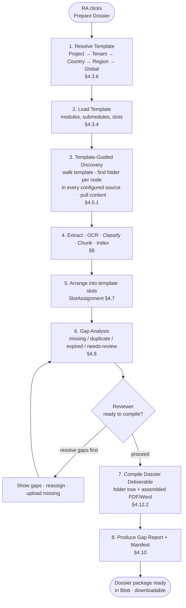

Every stage writes progress to `DossierRun` and emits audit events; the client shows a live status pane (like the Discovery Monitor, Screen 7).

Contract: `IDossierPreparationOrchestrator.PrepareAsync(projectId, options, ct)` returns a `DossierRun` handle. Options control whether to force re-discovery, whether to require human approval before compilation, and which output formats to produce.

#### 4.12.2 Dossier Compiler

The compiler takes the Arranged Dossier (§4.7.3) and produces the physical deliverable in **three artifacts**, all placed under a single Blob folder that represents the dossier package.

**Output layout** (`dossier-packages/{tenantId}/{projectId}/{runId}/`):

```
dossier-packages/{tenantId}/{projectId}/{runId}/
├── dossier/                            ← 1) FOLDER-TREE DELIVERABLE (per template)
│   ├── Module 1 - Administrative/
│   │   ├── 1.2 Application Form/
│   │   │   └── EU-Application-Form-signed.pdf
│   │   └── 1.3 Product Information/
│   ├── Module 2 - Summaries/
│   ├── Module 3 - Quality/
│   │   ├── 3.2.P - Drug Product/
│   │   │   ├── 3.2.P.8 - Stability/
│   │   │   │   ├── LTS-Batch24-002.pdf         ← primary assignment
│   │   │   │   ├── Accelerated-Stability.pdf
│   │   │   │   └── __alternates/               ← older versions kept for provenance
│   │   │   │       └── LTS-Batch24-001.pdf
│   │   │   └── 3.2.P.5 - Control of Drug Product/
│   │   └── 3.2.S - Drug Substance/
│   ├── Module 4 - Non-Clinical (Reference)/
│   └── Module 5 - Clinical (Reference)/
│
├── DossierAssembled.pdf                ← 2) SINGLE COMPILED PDF (cover + TOC + inline content)
├── DossierAssembled.docx               ← 2b) optional Word variant (cover + TOC + hyperlinks)
├── GapAnalysis.pdf                     ← 3) COMPANION GAP REPORT (FR-021, FR-026)
├── GapAnalysis.docx
└── manifest.json                       ← content inventory + template version + hashes
```

**Artifact 1 — Folder-tree deliverable**
- Mirrors the template hierarchy exactly, using the template's `folder` names for each node (numeric or descriptive per `FolderConvention`).
- Each leaf folder receives the primary document for every slot; alternatives (older versions, duplicates) go under `__alternates/`.
- Missing slots leave the folder empty (or absent) — `manifest.json` records the gap so downstream tools see it.
- Documents are **copied by reference** (server-side copy in the same storage account) — no bytes are moved unnecessarily; the operation is fast even for large dossiers.
- `NeedsReview` slots are placed in the folder but prefixed `_REVIEW_` so they visually stand out in Explorer / SharePoint sync views.

**Artifact 2 — Assembled dossier document**
- A single navigable PDF (via **QuestPDF**) or Word document (via **OpenXML SDK**) containing:
  - Cover page: project, product, template id + version, generated timestamp, submission country, applicant, prepared-by user.
  - Table of contents mirroring the template with hyperlinks to each section.
  - Per section: heading, expected content guidance from the template, then either the actual document embedded (PDF: page-import; Word: object insertion + hyperlink to the folder-tree copy) or a **"MISSING — Gap"** placeholder with the criticality label and suggested action.
  - Per section footer: source URI, effective date, version, classification confidence, slot-assignment evidence.
- The Word variant favours hyperlinks over embeds (keeps size manageable); the PDF variant embeds first N pages of each source and hyperlinks to the full file for deeper review.
- Very large sources (> configurable threshold, default 50 MB) are always hyperlinked rather than embedded to keep the assembled document usable.

**Artifact 3 — Gap Analysis report**
- Word + PDF exports of the current `GapRun` (§4.8) with the same content structure as the assembled dossier's TOC — one-to-one alignment so reviewers can flip between the two.

**`manifest.json`** — machine-readable inventory:
```json
{
  "runId": "…",
  "projectId": "…",
  "templateId": "EU-CENTR-SM",
  "templateVersion": "2026.07.01",
  "generatedUtc": "2026-07-06T13:15:22Z",
  "generatedBy": "user@contoso.com",
  "totalSlots": 412,
  "assigned": 388,
  "missingMandatory": 12,
  "nodes": [
    {
      "nodeId": "3.2.P.8",
      "title": "Stability",
      "path": "Module 3 - Quality/3.2.P - Drug Product/3.2.P.8 - Stability",
      "slots": [
        {
          "slotKey": "STABILITY_LONG_TERM",
          "status": "Assigned",
          "primary": {
            "documentId": "…",
            "sourceUri": "https://contoso.sharepoint.com/…/LTS-Batch24-002.pdf",
            "contentHash": "sha256:…",
            "version": "2.0",
            "effectiveDate": "2026-04-10",
            "classification": "StabilityReport",
            "confidence": 0.94
          },
          "alternates": [ { "documentId": "…", "version": "1.0" } ]
        },
        { "slotKey": "STABILITY_ACCELERATED", "status": "Missing", "mandatory": true }
      ]
    }
  ]
}
```

The manifest is the machine-readable *contract* the compiler emits — a future eCTD publisher (BRD Phase 3) will consume it directly.

#### 4.12.3 Data Model Additions

```sql
CREATE TABLE DossierRun (
    Id UNIQUEIDENTIFIER PRIMARY KEY,
    ProjectId UNIQUEIDENTIFIER NOT NULL FOREIGN KEY REFERENCES Project(Id),
    CtdTemplateVersionId UNIQUEIDENTIFIER NOT NULL FOREIGN KEY REFERENCES CtdTemplateVersion(Id),
    Status TINYINT NOT NULL,                  -- 0 Started, 1 Discovering, 2 Arranging, 3 Analyzing, 4 AwaitingApproval, 5 Compiling, 6 Completed, 7 Failed
    StartedUtc DATETIME2 NOT NULL,
    CompletedUtc DATETIME2 NULL,
    StartedBy NVARCHAR(200) NOT NULL,
    ApprovedBy NVARCHAR(200) NULL,
    PackageBlobPath NVARCHAR(500) NULL,       -- 'dossier-packages/{tenant}/{project}/{runId}/'
    ManifestBlobPath NVARCHAR(500) NULL,
    AssembledPdfPath NVARCHAR(500) NULL,
    AssembledDocxPath NVARCHAR(500) NULL,
    GapRunId UNIQUEIDENTIFIER NULL FOREIGN KEY REFERENCES GapRun(Id),
    ErrorPayload NVARCHAR(MAX) NULL
);
CREATE INDEX IX_DossierRun_Project_Started ON DossierRun (ProjectId, StartedUtc DESC);

CREATE TABLE DossierRunEvent (
    Id BIGINT IDENTITY PRIMARY KEY,
    DossierRunId UNIQUEIDENTIFIER NOT NULL FOREIGN KEY REFERENCES DossierRun(Id),
    OccurredUtc DATETIME2 NOT NULL,
    Stage NVARCHAR(40) NOT NULL,              -- 'ResolveTemplate' | 'Discovery' | 'Arrange' | ...
    Severity NVARCHAR(20) NOT NULL,           -- 'Info' | 'Warning' | 'Error'
    Message NVARCHAR(1000) NOT NULL,
    Payload NVARCHAR(MAX) NULL
);
```

#### 4.12.4 Screen — Prepare Dossier

Extends the Project view with a new **Prepare Dossier** action. Progression pane shows the 8-step timeline (§4.12.1) with per-step counters (nodes walked, folders found/missing, documents processed, slots assigned, gaps identified). On completion, reviewer sees:
- Download **Assembled Dossier (PDF/Word)**
- Download **Folder-Tree ZIP** (server-side zipped from the folder-tree deliverable)
- Download **Gap Analysis**
- Browse the package in Blob (SAS link, 15-min delegation token)

#### 4.12.5 Gap Semantics — "wherever content is not found is treated as a gap"

The dossier package treats **absence at every level** as a gap, and each is surfaced explicitly:

| Level of absence | Signal in package | Recorded in |
|---|---|---|
| Whole module folder missing in source | `MissingFolder` anomaly per node | `DossierRunEvent`, Gap report |
| Submodule folder missing | Empty folder in tree; placeholder in assembled PDF | Same |
| Slot expected but no document found | `GapSlot.Status = Missing` | `GapSlot` + `manifest.json` |
| Slot expected, mandatory, still missing after review | Blocking gap (compile still runs, but package is marked `IncompleteMandatory`) | `DossierRun.Status`, `manifest.json` |
| Content found but no template slot fits (unassigned) | Listed in `manifest.json / unassigned`; ends up under `dossier/__unassigned/` in the tree with a note | Anomaly report |

The user always gets a compiled deliverable — the compiler never blocks on gaps — but every gap is loudly visible in three places (the tree, the assembled document's placeholders, and the manifest). This aligns with your intent: the system *always* produces the dossier per the template's format, and the missing pieces *are* the gap.

---

## 5. AI Design — Classification, Embeddings, RAG

### 5.1 Model Selection

| Purpose | Model | Rationale |
|---|---|---|
| Classification (LLM path) | `gpt-4o-mini` (Azure OpenAI, EU region) | Cheap, fast, sufficient for classification with structured outputs; upgradable per §4.11. |
| Summarisation (FR-024) | `gpt-4o-mini` (default) / `gpt-4o` (long docs) | Quality vs. cost trade-off, configurable. |
| Copilot chat | `gpt-4o` | Superior reasoning + grounding fidelity for regulatory Q&A. |
| Embeddings | `text-embedding-3-large` (3072 dim) | Best-in-class semantic recall for regulatory language; supports dim reduction to 1536 for cost if needed. |
| OCR | Azure AI Document Intelligence `prebuilt-read` | Highest accuracy for scanned PDFs; layout model for tabular reports (specifications, CoAs). |

All Azure OpenAI usage runs in an **EU-resident region** (Sweden Central primary, France Central secondary) — no data leaves EU (BRD §11.1 EU market focus).

### 5.2 Classification Pipeline Detail

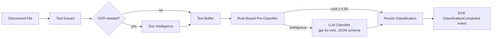

**Prompt template** (excerpt):

> You are an expert EU pharmaceutical regulatory reviewer. Classify the following document into exactly one of these categories: {taxonomy}. Return JSON matching this schema: {schema}. If uncertain, choose `Unknown`. Do not invent categories.

**Guardrails**
- Response validated against JSON schema (retry with error feedback on failure, max 2 retries).
- If final result is `Unknown` with conf < 0.5, document is flagged `NeedsReview` in UI.
- All prompts + responses logged to App Insights `dependencies` telemetry (PII-scrubbed).

### 5.3 CTD Slot Disambiguation via LLM (Signal S4)

When the template-driven resolver (§4.7.1) leaves two candidate slots within the ambiguity band (top score gap < 0.10), an LLM pass disambiguates using: the slot definitions (name, description, guidance, expected classifications), a compact excerpt of the document (first + last N chunks + any table headings), and the source folder path. Returns the winning `slotKey` with confidence; if the LLM confidence is itself below threshold, the assignment remains `NeedsReview` for human decision (FR-018).

Prompt (excerpt):
> You are arranging a pharmaceutical dossier per the EU CTD. Two candidate CTD slots have been proposed for the following document. Choose the correct slot using the slot definitions and the document evidence provided. If neither fits, return `null`. Reply as JSON `{ "slot": "<key or null>", "confidence": 0..1, "reasoning": "..." }`.

### 5.4 RAG Pipeline (Regulatory Copilot)

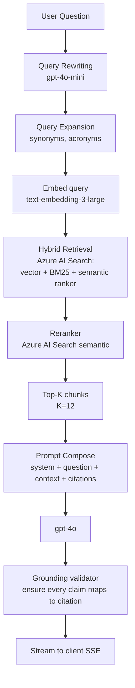

**Chunking strategy**
- Documents split into overlapping chunks: **1000 tokens ± 20% with 200-token overlap**, boundary-aware (paragraphs, headings).
- Metadata carried per chunk: `documentId`, `page`, `section`, `ctdModule`, `classification`, `effectiveDate`, `projectId`, `securityFilterTags`.

**Retrieval filter**: Search always filtered by `projectId` and by the user's Entra group membership tags → hard multi-tenant isolation.

**Prompt template (chat)** (excerpt):

```
System:
You are the AI Regulatory Assistant. Answer regulatory questions using ONLY the
provided context. If the answer is not in the context, say "I could not find this
in the indexed documentation." Every factual claim MUST cite the source using the
[[docId:page]] convention. Do not speculate. Do not answer general regulatory
questions outside the scope of the indexed project documents.

Context:
{retrieved_chunks_with_ids}

Question:
{user_question}
```

**Citation validation**: After the model responds, a lightweight post-processor checks that every `[[docId:page]]` marker exists in the retrieved context. Any unfounded reference is stripped and the sentence is downgraded to "Insufficient evidence."

**Latency budget** (NFR-008: 15 s p95):
| Stage | p95 budget |
|---|---|
| Query rewriting | 1.0 s |
| Embedding | 0.3 s |
| Search (hybrid + rerank) | 1.5 s |
| Prompt compose | 0.1 s |
| gpt-4o generation | 10 s |
| Streaming first token | ≤ 2 s |
| **Total (first byte / final)** | **~13 s / ~15 s** |

**Conversation memory**: last N turns (default 5) carried as a summarised context; full history persisted for audit.

---

## 6. Data Design — SQL Server, AI Search, Blob

### 6.1 Storage Choices

| Data | Store | Reason |
|---|---|---|
| Projects, requirements, documents metadata, audit | Azure SQL DB | Relational, transactional, easy reporting. |
| Embeddings + full-text | Azure AI Search | Native vector + hybrid + semantic ranker. |
| Extracted document text, cached originals, reports | Azure Blob Storage | Cheap, private, SAS access. |
| Local user cache | LiteDB (client) | Offline UI responsiveness. |
| Secrets | Azure Key Vault | Compliance (NFR-019). |

### 6.2 Relational Schema (Azure SQL)

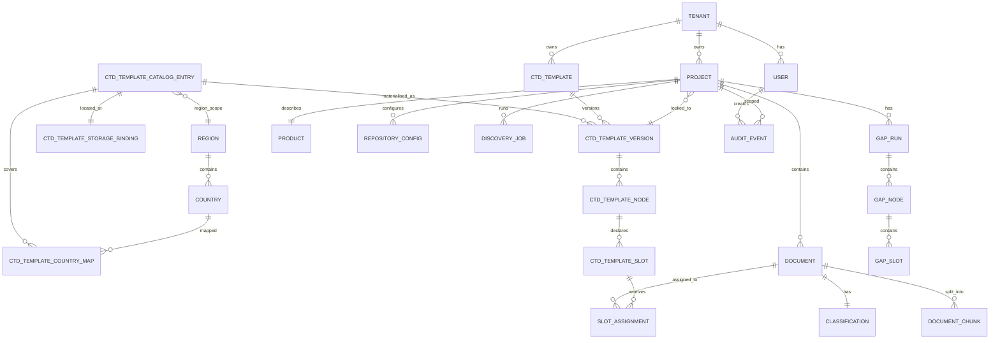

**Key tables (abridged DDL)**

```sql
CREATE TABLE Project (
    Id UNIQUEIDENTIFIER PRIMARY KEY,
    TenantId UNIQUEIDENTIFIER NOT NULL,
    Name NVARCHAR(200) NOT NULL,
    Status TINYINT NOT NULL,             -- 0 Draft, 1 Active, 2 Archived
    Country CHAR(2) NOT NULL,            -- 'EU' for MVP
    Procedure NVARCHAR(50) NOT NULL,
    Applicant NVARCHAR(200) NOT NULL,
    Description NVARCHAR(2000) NULL,
    DiscoveryStarted BIT NOT NULL DEFAULT 0,
    CtdTemplateVersionId UNIQUEIDENTIFIER NOT NULL,   -- locked at creation
    CreatedUtc DATETIME2 NOT NULL,
    CreatedBy NVARCHAR(200) NOT NULL,
    CONSTRAINT UX_Project_Tenant_Name UNIQUE (TenantId, Name)
);

-- CTD Dossier Template (template-driven design, ADR-013) --------------------

-- Country / Region reference data (seeded) -----------------------------------
CREATE TABLE Region (
    Code NVARCHAR(20) PRIMARY KEY,           -- 'EU', 'US', 'APAC', 'ICH'
    Name NVARCHAR(100) NOT NULL,
    IsActive BIT NOT NULL DEFAULT 1
);

CREATE TABLE Country (
    Code CHAR(2) PRIMARY KEY,                -- ISO 3166-1 alpha-2, e.g. 'DE'
    Name NVARCHAR(100) NOT NULL,
    RegionCode NVARCHAR(20) NOT NULL FOREIGN KEY REFERENCES Region(Code),
    IsActive BIT NOT NULL DEFAULT 1
);

-- System catalog: content-addressed templates shipped by product team --------
CREATE TABLE CtdTemplateCatalogEntry (
    Id UNIQUEIDENTIFIER PRIMARY KEY,
    CatalogKey NVARCHAR(120) NOT NULL,       -- 'EU-CENTR-SM-2026.07.01'
    DisplayName NVARCHAR(200) NOT NULL,
    RegionCode NVARCHAR(20) NULL FOREIGN KEY REFERENCES Region(Code),  -- null if country-only
    Procedure NVARCHAR(50) NOT NULL,
    ProductType NVARCHAR(80) NULL,
    Version NVARCHAR(40) NOT NULL,
    ContentHash CHAR(64) NOT NULL,           -- SHA-256; identity of the physical file
    Status TINYINT NOT NULL,                 -- 0 Draft, 1 Available, 2 Deprecated, 3 Withdrawn
    EffectiveFrom DATE NOT NULL,
    EffectiveTo DATE NULL,
    PublishedUtc DATETIME2 NOT NULL,
    PublishedBy NVARCHAR(200) NOT NULL,
    CONSTRAINT UX_CatalogEntry_Key_Version UNIQUE (CatalogKey, Version),
    CONSTRAINT UX_CatalogEntry_Hash UNIQUE (ContentHash)
);

-- Many-to-many: one catalog entry can serve many countries ------------------
CREATE TABLE CtdTemplateCountryMap (
    Id BIGINT IDENTITY PRIMARY KEY,
    CatalogEntryId UNIQUEIDENTIFIER NOT NULL FOREIGN KEY REFERENCES CtdTemplateCatalogEntry(Id),
    CountryCode CHAR(2) NOT NULL FOREIGN KEY REFERENCES Country(Code),
    IsPrimaryForCountry BIT NOT NULL DEFAULT 0,   -- if multiple entries cover same country/procedure, which wins
    Notes NVARCHAR(500) NULL,
    CONSTRAINT UX_CatalogCountry UNIQUE (CatalogEntryId, CountryCode)
);
CREATE INDEX IX_CtdTemplateCountryMap_Country ON CtdTemplateCountryMap (CountryCode);

-- Where the bytes physically live (allows relocation without touching tenants)
CREATE TABLE CtdTemplateStorageBinding (
    Id UNIQUEIDENTIFIER PRIMARY KEY,
    CatalogEntryId UNIQUEIDENTIFIER NULL FOREIGN KEY REFERENCES CtdTemplateCatalogEntry(Id),
    TenantId UNIQUEIDENTIFIER NULL,          -- null for system catalog; set for tenant overrides
    ProjectId UNIQUEIDENTIFIER NULL,         -- set for project-scope overrides
    StorageAccountUri NVARCHAR(300) NOT NULL,-- e.g. 'https://stara-catalog.blob.core.windows.net'
    ContainerName NVARCHAR(100) NOT NULL,
    BlobPathDocx NVARCHAR(500) NULL,
    BlobPathYaml NVARCHAR(500) NOT NULL,
    Sas TINYINT NOT NULL DEFAULT 0,          -- 0 = MI access only, 1 = SAS (rare, for on-prem workers)
    CreatedUtc DATETIME2 NOT NULL,
    CONSTRAINT CK_Binding_Scope
        CHECK (
            (CatalogEntryId IS NOT NULL AND TenantId IS NULL AND ProjectId IS NULL) OR
            (CatalogEntryId IS NULL AND TenantId IS NOT NULL AND ProjectId IS NULL) OR
            (CatalogEntryId IS NULL AND TenantId IS NOT NULL AND ProjectId IS NOT NULL)
        )
);
CREATE INDEX IX_TemplateBinding_Tenant ON CtdTemplateStorageBinding (TenantId, ProjectId);

-- Tenant/project overrides use the existing CtdTemplate + CtdTemplateVersion --
CREATE TABLE CtdTemplate (
    Id UNIQUEIDENTIFIER PRIMARY KEY,
    TenantId UNIQUEIDENTIFIER NOT NULL,
    TemplateKey NVARCHAR(80) NOT NULL,       -- e.g. 'EU-CTD-SmallMolecule-Centralised'
    DisplayName NVARCHAR(200) NOT NULL,
    Region NVARCHAR(20) NOT NULL,            -- 'EU'
    Procedure NVARCHAR(50) NOT NULL,
    ProductType NVARCHAR(80) NULL,
    CONSTRAINT UX_CtdTemplate_Tenant_Key UNIQUE (TenantId, TemplateKey)
);

CREATE TABLE CtdTemplateVersion (
    Id UNIQUEIDENTIFIER PRIMARY KEY,
    TemplateId UNIQUEIDENTIFIER NOT NULL FOREIGN KEY REFERENCES CtdTemplate(Id),
    Version NVARCHAR(40) NOT NULL,            -- '2026.07.01'
    Scope TINYINT NOT NULL,                   -- 0 SystemCatalog, 1 Tenant, 2 Project
    OriginCatalogEntryId UNIQUEIDENTIFIER NULL FOREIGN KEY REFERENCES CtdTemplateCatalogEntry(Id),
    OverriddenForCountry CHAR(2) NULL,        -- when Scope=Tenant and it overrides a specific country
    ProjectId UNIQUEIDENTIFIER NULL,          -- set when Scope=Project
    StorageBindingId UNIQUEIDENTIFIER NOT NULL FOREIGN KEY REFERENCES CtdTemplateStorageBinding(Id),
    ParsedYaml NVARCHAR(MAX) NOT NULL,
    FolderConvention NVARCHAR(20) NOT NULL,
    EffectiveFrom DATE NOT NULL,
    EffectiveTo DATE NULL,
    PublishedUtc DATETIME2 NOT NULL,
    PublishedBy NVARCHAR(200) NOT NULL,
    IsActive BIT NOT NULL DEFAULT 1,
    CONSTRAINT UX_CtdTemplateVersion UNIQUE (TemplateId, Version)
);
CREATE INDEX IX_CtdTemplateVersion_Scope ON CtdTemplateVersion (Scope, OverriddenForCountry, IsActive);

CREATE TABLE CtdTemplateNode (
    Id UNIQUEIDENTIFIER PRIMARY KEY,
    TemplateVersionId UNIQUEIDENTIFIER NOT NULL FOREIGN KEY REFERENCES CtdTemplateVersion(Id),
    ParentNodeId UNIQUEIDENTIFIER NULL,
    NodeKey NVARCHAR(40) NOT NULL,            -- e.g. '3.2.P.8'
    Title NVARCHAR(300) NOT NULL,
    Folder NVARCHAR(300) NOT NULL,            -- expected folder-name segment
    AliasesJson NVARCHAR(1000) NULL,          -- ['M3','Drug Product', ...]
    OrderIndex INT NOT NULL,
    ReferenceOnly BIT NOT NULL DEFAULT 0,
    INDEX IX_CtdTemplateNode_Parent (ParentNodeId)
);

CREATE TABLE CtdTemplateSlot (
    Id UNIQUEIDENTIFIER PRIMARY KEY,
    NodeId UNIQUEIDENTIFIER NOT NULL FOREIGN KEY REFERENCES CtdTemplateNode(Id),
    SlotKey NVARCHAR(80) NOT NULL,            -- e.g. 'STABILITY_LONG_TERM'
    Name NVARCHAR(300) NOT NULL,
    Description NVARCHAR(1000) NULL,
    Guidance NVARCHAR(2000) NULL,
    Mandatory BIT NOT NULL,
    ExpectedTypesCsv NVARCHAR(200) NULL,      -- 'pdf,docx'
    FilenamePatternsJson NVARCHAR(2000) NULL,
    ExpectedClassificationsCsv NVARCHAR(500) NULL,
    CONSTRAINT UX_CtdTemplateSlot UNIQUE (NodeId, SlotKey)
);

-- Document core (unchanged) --------------------------------------------------

CREATE TABLE Document (
    Id UNIQUEIDENTIFIER PRIMARY KEY,
    ProjectId UNIQUEIDENTIFIER NOT NULL FOREIGN KEY REFERENCES Project(Id),
    RepositoryConfigId UNIQUEIDENTIFIER NOT NULL,
    SourceUri NVARCHAR(2000) NOT NULL,        -- canonical source path/URL (drives folder matching)
    ContentHash CHAR(64) NOT NULL,
    Title NVARCHAR(500) NOT NULL,
    FileType NVARCHAR(10) NOT NULL,
    SizeBytes BIGINT NOT NULL,
    Version NVARCHAR(50) NULL,
    EffectiveDate DATE NULL,
    Owner NVARCHAR(200) NULL,
    Department NVARCHAR(200) NULL,
    ExtractedTextBlobUri NVARCHAR(500) NULL,
    OcrApplied BIT NOT NULL DEFAULT 0,
    DiscoveredUtc DATETIME2 NOT NULL,
    INDEX IX_Document_Project_Hash (ProjectId, ContentHash)
);

CREATE TABLE Classification (
    DocumentId UNIQUEIDENTIFIER PRIMARY KEY FOREIGN KEY REFERENCES Document(Id),
    Category NVARCHAR(80) NOT NULL,
    Confidence DECIMAL(4,3) NOT NULL,
    Reasoning NVARCHAR(2000) NULL,
    Method NVARCHAR(20) NOT NULL,            -- 'Rule' | 'Llm' | 'ManualOverride'
    OverriddenBy NVARCHAR(200) NULL,
    OverriddenUtc DATETIME2 NULL,
    OriginalCategory NVARCHAR(80) NULL
);

-- Template-slot assignment replaces the old CtdMapping table ------------------

CREATE TABLE SlotAssignment (
    Id UNIQUEIDENTIFIER PRIMARY KEY,
    ProjectId UNIQUEIDENTIFIER NOT NULL FOREIGN KEY REFERENCES Project(Id),
    DocumentId UNIQUEIDENTIFIER NOT NULL FOREIGN KEY REFERENCES Document(Id),
    TemplateSlotId UNIQUEIDENTIFIER NOT NULL FOREIGN KEY REFERENCES CtdTemplateSlot(Id),
    Score DECIMAL(4,3) NOT NULL,
    Status TINYINT NOT NULL,                  -- 0 Assigned, 1 NeedsReview, 2 Suppressed
    IsPrimary BIT NOT NULL DEFAULT 0,         -- primary vs alternative for the slot
    IsManualOverride BIT NOT NULL DEFAULT 0,
    OverriddenBy NVARCHAR(200) NULL,
    EvidenceJson NVARCHAR(2000) NULL,         -- [{ signal:'Folder', weight:0.5, detail:'...'}]
    CreatedUtc DATETIME2 NOT NULL,
    INDEX IX_SlotAssignment_Project_Slot (ProjectId, TemplateSlotId),
    INDEX IX_SlotAssignment_Document (DocumentId)
);

CREATE TABLE UnassignedItem (
    Id UNIQUEIDENTIFIER PRIMARY KEY,
    ProjectId UNIQUEIDENTIFIER NOT NULL FOREIGN KEY REFERENCES Project(Id),
    DocumentId UNIQUEIDENTIFIER NOT NULL FOREIGN KEY REFERENCES Document(Id),
    Reason NVARCHAR(200) NOT NULL,            -- 'NoFolderMatch' | 'LowScore' | 'UnknownFolder'
    SuggestedSlotsJson NVARCHAR(2000) NULL,
    CreatedUtc DATETIME2 NOT NULL
);

-- Gap Analysis (template-driven) --------------------------------------------

CREATE TABLE GapRun (
    Id UNIQUEIDENTIFIER PRIMARY KEY,
    ProjectId UNIQUEIDENTIFIER NOT NULL FOREIGN KEY REFERENCES Project(Id),
    CtdTemplateVersionId UNIQUEIDENTIFIER NOT NULL FOREIGN KEY REFERENCES CtdTemplateVersion(Id),
    ExecutedUtc DATETIME2 NOT NULL,
    ExecutedBy NVARCHAR(200) NOT NULL,
    TotalSlots INT NOT NULL,
    Assigned INT NOT NULL,
    MissingMandatory INT NOT NULL,
    MissingOptional INT NOT NULL,
    Duplicates INT NOT NULL,
    Expired INT NOT NULL,
    NeedsReview INT NOT NULL,
    CompletionPct DECIMAL(5,2) NOT NULL
);

CREATE TABLE GapNode (
    Id BIGINT IDENTITY PRIMARY KEY,
    GapRunId UNIQUEIDENTIFIER NOT NULL FOREIGN KEY REFERENCES GapRun(Id),
    TemplateNodeId UNIQUEIDENTIFIER NOT NULL FOREIGN KEY REFERENCES CtdTemplateNode(Id),
    Status NVARCHAR(20) NOT NULL              -- Complete|Partial|Missing|NeedsReview
);

CREATE TABLE GapSlot (
    Id BIGINT IDENTITY PRIMARY KEY,
    GapRunId UNIQUEIDENTIFIER NOT NULL FOREIGN KEY REFERENCES GapRun(Id),
    TemplateSlotId UNIQUEIDENTIFIER NOT NULL FOREIGN KEY REFERENCES CtdTemplateSlot(Id),
    Status NVARCHAR(20) NOT NULL,             -- Assigned|Missing|Duplicate|Expired|NeedsReview
    AssignedDocumentId UNIQUEIDENTIFIER NULL,
    Flags NVARCHAR(200) NULL,                 -- 'Duplicate,VersionConflict'
    Notes NVARCHAR(1000) NULL
);

CREATE TABLE AuditEvent (
    Id BIGINT IDENTITY PRIMARY KEY,
    OccurredUtc DATETIME2 NOT NULL,
    Actor NVARCHAR(200) NOT NULL,
    Action NVARCHAR(100) NOT NULL,
    ProjectId UNIQUEIDENTIFIER NULL,
    TargetType NVARCHAR(100) NULL,
    TargetId NVARCHAR(200) NULL,
    Payload NVARCHAR(MAX) NULL,
    CorrelationId NVARCHAR(64) NOT NULL
);
```

Row-level security policies filter every query by `TenantId`. Temporal tables (`SYSTEM_VERSIONING = ON`) provide full history for `Project`, `RepositoryConfig`, `Classification`, `SlotAssignment`, and `CtdTemplateVersion`.

### 6.3 Azure AI Search Index

**Index name**: `ara-documents-v1` (versioned; blue/green swap for schema changes).

```jsonc
{
  "name": "ara-documents-v1",
  "fields": [
    { "name": "id", "type": "Edm.String", "key": true },
    { "name": "tenantId", "type": "Edm.String", "filterable": true },
    { "name": "projectId", "type": "Edm.String", "filterable": true },
    { "name": "documentId", "type": "Edm.String", "filterable": true },
    { "name": "chunkIndex", "type": "Edm.Int32", "filterable": true },
    { "name": "title", "type": "Edm.String", "searchable": true },
    { "name": "content", "type": "Edm.String", "searchable": true, "analyzer": "en.microsoft" },
    { "name": "ctdModule", "type": "Edm.String", "filterable": true, "facetable": true },
    { "name": "ctdSection", "type": "Edm.String", "filterable": true, "facetable": true },
    { "name": "classification", "type": "Edm.String", "filterable": true, "facetable": true },
    { "name": "effectiveDate", "type": "Edm.DateTimeOffset", "filterable": true, "sortable": true },
    { "name": "sourceUri", "type": "Edm.String" },
    { "name": "page", "type": "Edm.Int32" },
    { "name": "securityTags", "type": "Collection(Edm.String)", "filterable": true },
    {
      "name": "contentVector", "type": "Collection(Edm.Single)",
      "dimensions": 3072, "vectorSearchProfile": "vs-hnsw-cosine"
    }
  ],
  "vectorSearch": {
    "algorithms": [{ "name": "hnsw-1", "kind": "hnsw" }],
    "profiles": [{ "name": "vs-hnsw-cosine", "algorithm": "hnsw-1" }]
  },
  "semantic": {
    "configurations": [{
      "name": "sem-config-1",
      "prioritizedFields": {
        "titleField": { "fieldName": "title" },
        "prioritizedContentFields": [{ "fieldName": "content" }],
        "prioritizedKeywordsFields": [{ "fieldName": "classification" }]
      }
    }]
  }
}
```

**Scale sizing** (NFR-010: 1 M docs)
- Assumed average 40 chunks/document → **40 M chunk records**.
- With `text-embedding-3-large` at 3072 dims (12 KB/vector) = ~480 GB raw vectors → use Standard S2 with 2 partitions × 2 replicas initially, scale to S3 if needed. Enable stored=false on `content` beyond a limit and rely on Blob for raw text retrieval.

### 6.4 Blob Storage Layout

```
containers:
  raw-cache/          # optional cached originals (encrypted at rest)
    {tenantId}/{projectId}/{documentId}/{filename}
  extracted-text/     # text-only extracted from documents
    {tenantId}/{projectId}/{documentId}.txt
  report-templates/
    gap-analysis-v1.docx
    inventory-v1.docx
  report-outputs/
    {tenantId}/{projectId}/{runId}/gap-analysis.docx
```

- Storage account: **hierarchical namespace enabled (ADLS Gen2)** to leverage POSIX ACLs.
- Server-side encryption with customer-managed key stored in Key Vault (compliance ready).
- Lifecycle rules: `report-outputs` → cool after 30 days, delete after 365 (configurable).

### 6.5 Backup & Retention (NFR §22.9)

- Azure SQL: automated PITR (7 days short-term) + LTR (weekly for 12 months).
- Blob: soft-delete 30 days + versioning.
- AI Search index: rebuildable from SQL + Blob, so no dedicated backup; documented rebuild playbook.

---

## 7. Integration Design — Repository Connectors

### 7.1 Connector Registration

Connectors are discovered at startup via MEF-style scanning of assemblies satisfying `IRepositoryConnector`. Each connector self-declares:

```csharp
[Connector(Type=RepositoryType.SharePointOnline,
           DisplayName="SharePoint Online",
           ConfigSchema=typeof(SharePointConfig))]
public sealed class SharePointOnlineConnector : IRepositoryConnector { ... }
```

The Admin UI renders configuration forms from the referenced `ConfigSchema` JSON schema.

### 7.2 SharePoint Online

- Uses Microsoft Graph via `Microsoft.Graph` SDK.
- Auth: **On-Behalf-Of (OBO)** flow → user's delegated token is exchanged for a Graph token; ensures the connector only sees documents the user is allowed to see.
- Enumeration: `sites/{siteId}/drives/{driveId}/root/children` with delta queries for incremental scans.
- Throttling: honours `Retry-After` header; connector pauses jobs on `429`.

### 7.3 Azure Blob Storage

- Uses `BlobServiceClient(new DefaultAzureCredential())` for MI-based access from workers.
- Configuration includes `accountUrl`, optional `containerName`, optional `prefix`.
- Enumeration: `GetBlobsAsync` with `Include=Metadata`.

### 7.4 Network Share / Local Folder

- Because these are on-prem, MVP supports two execution modes:
  - **Client-side scan**: WPF client scans files locally, uploads only extracted text + hash + metadata to server (no raw docs leave the client unless user opts in). Server then indexes/embeds.
  - **On-prem worker** (opt-in): a lightweight self-hosted worker runs inside the corporate network and connects outbound to Azure Service Bus. Recommended for large shares.

### 7.5 Data Movement Options

Per project the admin selects one of:
1. **Metadata-only** — no bytes leave premises; embeddings computed on extracted text only, cached in AI Search.
2. **Text-cached** — extracted text stored in Blob (encrypted).
3. **Full cache** — raw file mirrored to Blob (fastest reprocessing; strongest data residency compliance if disabled).

Choice is captured in `RepositoryConfig.DataMovementPolicy` and audit-logged.

### 7.6 Sequence — Discovery over SharePoint

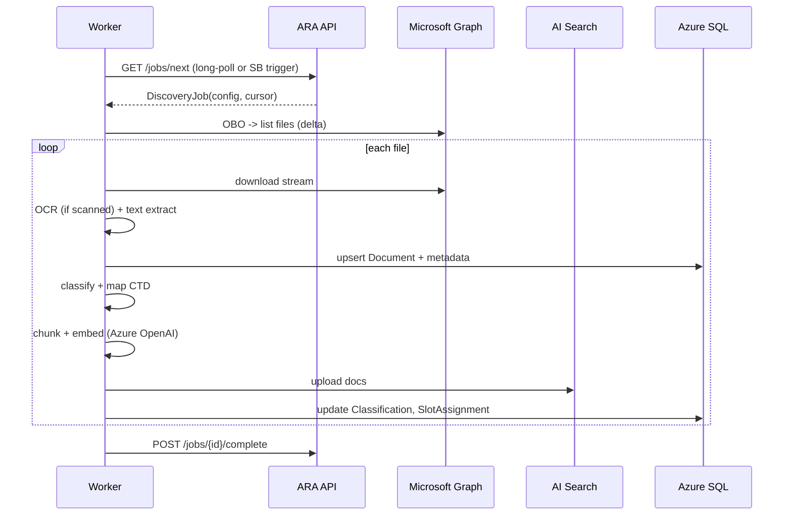

---

## 8. Discovery & Indexing Pipeline

### 8.1 States

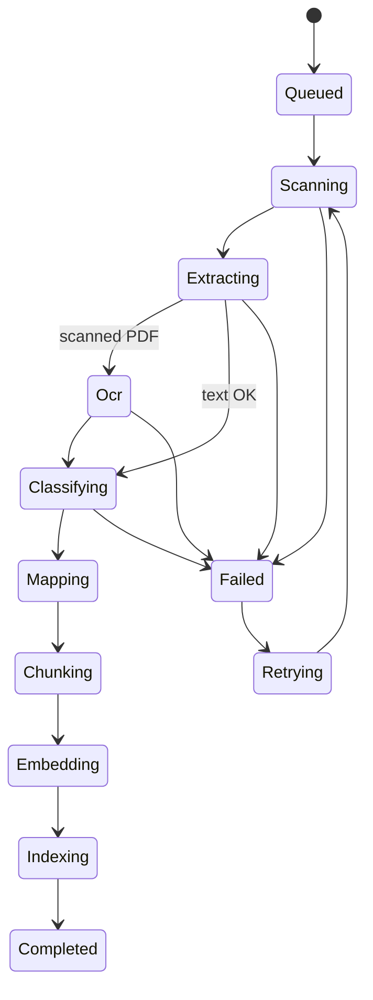

Each transition is a **durable step** persisted in SQL. Restartable at any state (P3).

### 8.2 Message Flow (Azure Service Bus)

Queues (per-tenant, session-enabled where ordering matters):
- `discovery-jobs` — top-level job (per repository scan).
- `document-processing` — per-document unit; batches processed by the worker.
- `document-processing-dlq` — dead-letter for permanent failures.

Workers scale on `serviceBusMessageCount` KEDA rule; min 0, max configurable (default 10).

### 8.3 Throughput Model

BRD NFR-005 targets **≥ 500 docs / hour / worker**.

Per-document budget:
| Step | Time (approx) |
|---|---|
| Download | 200 ms |
| Text extract (non-OCR) | 300 ms |
| OCR (if applied, 20 pp doc) | 6 s (batched) |
| Classification (rule path) | 50 ms |
| Classification (LLM path) | 1.5 s (subset) |
| Chunking | 100 ms |
| Embedding (40 chunks, batched) | 1.2 s |
| Index upload | 400 ms |
| **Per-doc average** | **~4–7 s** |

At 5 s average, one worker processes ~720/hour → NFR-005 met with margin. OCR-heavy repos scale with additional workers (NFR-006, NFR-011).

### 8.4 Progress Reporting

- Worker writes `DiscoveryJob.CountersJson` every 10 s (files found, processed, failed, OCR queued).
- API exposes SignalR hub `/hubs/discovery/{jobId}`; client subscribes for live updates on Screen 7 (Discovery Monitor).

### 8.5 Resumability

- Every enqueued message carries an idempotency key `(repositoryConfigId, sourceUri, contentHash)`.
- Upserts are keyed on that tuple → replay-safe.
- On worker crash, SB redelivers unfinished messages.

---

## 9. Security Design

### 9.1 Identity & Access

| Concern | Mechanism |
|---|---|
| User authentication | Entra ID OIDC (MSAL.NET WAM broker) |
| Service-to-service auth | Managed Identity (API → SQL, Search, OpenAI, Key Vault, Blob) |
| SharePoint access | Delegated OBO flow (user's own permissions) |
| API authorization | JWT validation via `Microsoft.Identity.Web` |
| Role → capability mapping | Entra group claims → policies (`RegulatoryExecutive`, `RegulatoryManager`, `QAReviewer`, `Administrator`) |
| Tenant isolation | Row-level security in SQL + `tenantId` filter on all Search queries + Blob ACL by tenant path |

### 9.2 Data Protection

- **In transit**: TLS 1.2+ enforced everywhere; HTTPS-only endpoints; `HttpClient` pinned to TLS 1.2+ (NFR-018).
- **At rest**:
  - Azure SQL: TDE with customer-managed key from Key Vault.
  - Blob: server-side encryption with CMK.
  - AI Search: Microsoft-managed encryption + optional CMK.
- **Client-side cache**: LiteDB file encrypted with per-user DPAPI-derived key; MSAL token cache DPAPI-encrypted (Windows) via `MsalCacheHelper`.

### 9.3 Secrets

- No secrets in code, config files, or client. All secrets in Azure Key Vault, accessed via Managed Identity (NFR-019).
- Client → API: only the OIDC access token. No API keys.
- CI/CD: Federated Credentials (workload identity) for GitHub Actions / Azure Pipelines, no long-lived PATs.

### 9.4 Audit Trail (§22.7)

- Written to `AuditEvent` table via an outbox pattern: application services enqueue events in the same DB transaction as the state change; a background job forwards them to Log Analytics/Storage for long-term retention.
- Every event carries a `correlationId` propagated from the originating HTTP request (`traceparent` header).

### 9.5 PII & Regulatory Data Handling

- The system processes commercial regulatory documents, generally not personal data — but batch records may contain operator names and study reports may contain investigator names.
- Any AI logs sent to Application Insights are **redacted** via a `TelemetryProcessor` that runs regex-based PII scrubbers (emails, phone numbers, patient IDs).
- No document *content* is ever logged. Only metadata, hashes, and outcomes.

### 9.6 Threat Model (STRIDE — abbreviated)

| Threat | Mitigation |
|---|---|
| **S**poofing (user) | Entra ID + MFA + conditional access |
| **T**ampering (index) | Signed AI Search API calls via MI; row-level tenant filter; audit hash of index writes |
| **R**epudiation | Audit trail with correlation IDs |
| **I**nformation disclosure | Tenant filters, RBAC, TLS, CMK encryption, no cross-tenant retrieval in RAG |
| **D**oS | API rate-limiting (fixed-window + concurrency), AI Search throttling, per-project quotas |
| **E**levation of privilege | Server-side authorization on every endpoint; policies derived only from validated token; no client-supplied role hints |

---

## 10. Non-Functional Design

Each NFR from BRD §22 is realised by explicit mechanisms.

| NFR | Mechanism |
|---|---|
| NFR-001 startup ≤ 10 s | Lazy shell composition; MSAL cache warm-up async; local cache priming off UI thread. |
| NFR-002 auth ≤ 5 s | WAM broker uses cached primary refresh token; ~1–3 s typical. |
| NFR-003 dashboard ≤ 3 s / 10 k docs | Aggregate KPIs pre-computed in SQL views; client renders from cached DTOs. |
| NFR-004 repo test ≤ 10 s | Connector interface enforces `TestAsync` with 10 s timeout. |
| NFR-005 ≥ 500 docs/hr/worker | See §8.3 throughput model. |
| NFR-006 concurrent OCR | Doc Intelligence pool sized 4× workers; SB partitioning. |
| NFR-007 gap ≤ 30 s / 20 k | Single-query CTE + covered indexes on `Document(ProjectId, ContentHash)` and `SlotAssignment(ProjectId, TemplateSlotId)`; arrangement materialised at discovery. |
| NFR-008 Copilot ≤ 15 s p95 | Latency budget §5.4; streaming SSE for perceived latency. |
| NFR-009 500 active projects | Multi-tenant with per-project partitioning in Blob and RLS in SQL. |
| NFR-010 1 M docs | AI Search S2 with 2 partitions initially; horizontal scale to S3. |
| NFR-011 horizontal scale | Container Apps + KEDA + SB queue depth. |
| NFR-012 plug-in connectors | `IRepositoryConnector` (§7). |
| NFR-013 99.5% availability | Zone-redundant App Service, Az SQL Business Critical option, SB Premium (post-MVP). |
| NFR-014 maintenance windows | Blue/green with slot swap; Azure SQL maintenance window configured. |
| NFR-015 resumable jobs | State machine + SB DLQ + idempotent upserts. |
| NFR-016–019 security | See §9. |
| NFR-020 audit | See §9.4. |
| NFR-Reliability | Polly resilience (retry + circuit breaker + timeout); Service Bus reliable messaging; no fire-and-forget. |
| NFR-Maintainability | Clean Arch + DI + connector plug-ins; per-module test suites; config-driven behaviour. |

---

## 11. Deployment Architecture

### 11.0 Deployment Model — BYOC (Bring Your Own Cloud)

ARA is delivered as a **customer-deployed product**, not a shared SaaS. Each customer owns:

- Their **Azure subscription** — hosts SQL, AI Search, Azure OpenAI, App Service, Key Vault, Storage, Log Analytics
- Their **Entra ID tenant** — hosts app registrations, users, security groups, RBAC assignments
- Their **data plane** — no customer data ever leaves the customer's subscription

Publisher (Stara) owns:

- The **source code**, build, test, signing, and artifact publication
- A **release feed** (container images, Bicep templates, MSIX installers, SBOMs, manifests) hosted in the publisher's Azure tenant
- The **product roadmap** and support process

**Consequence**: the app is **single-tenant per install** (`signInAudience = AzureADMyOrg`). There is no multi-tenant Entra ID configuration and no cross-tenant data plane. Isolation is physical (subscription boundary), not logical (tenant-id filter).

See **ADR-018** for the rationale.

---

### 11.1 Deployment Topology — "Publisher builds, Customer deploys"

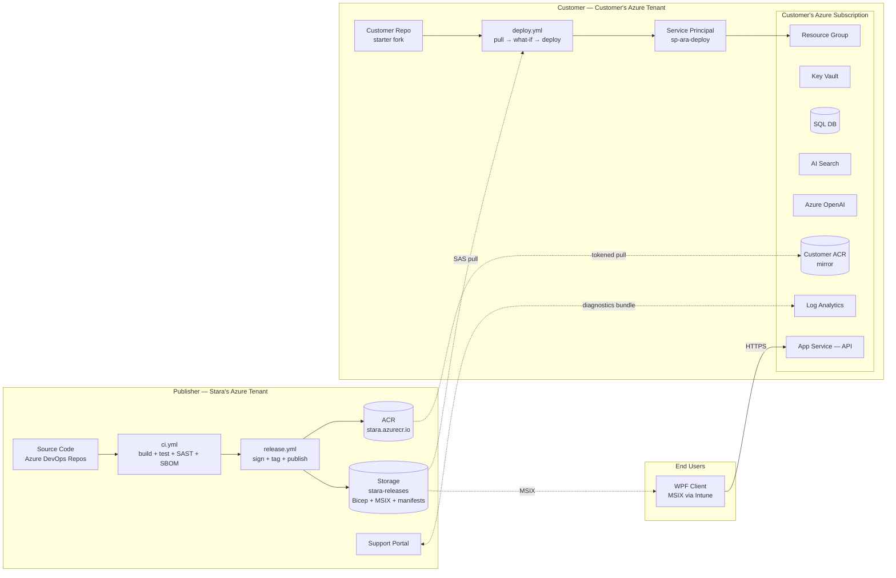

Publisher never signs into the customer's subscription. The only artifacts that cross the boundary are **signed binaries** pulled by the customer's pipeline.

---

### 11.2 Customer Subscription — Reference Architecture

What each customer install provisions inside their own subscription.

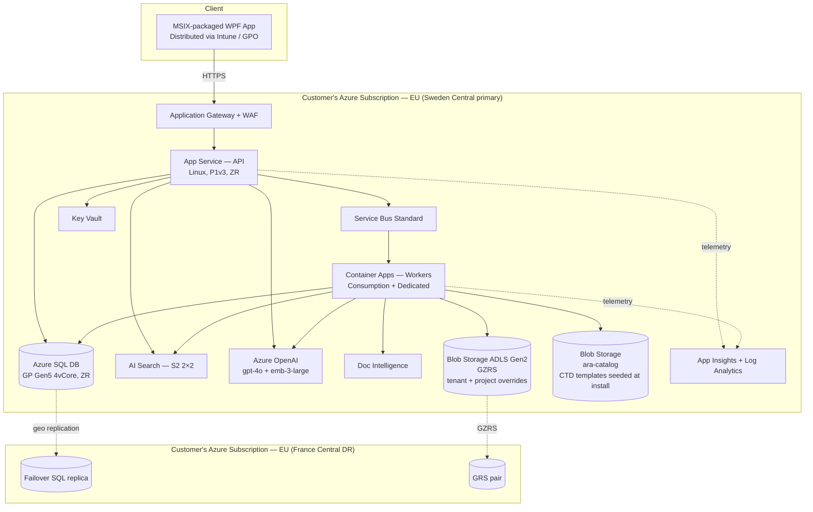

**Sizing tiers** shipped as Bicep parameter presets:

| Tier | Users | SQL | AI Search | OpenAI | App Service |
|---|---|---|---|---|---|
| Small | ≤ 25 | GP Gen5 2vCore | S1 (1×1) | S0 (pay-as-you-go) | P1v3 |
| Medium (default) | ≤ 100 | GP Gen5 4vCore, ZR | S2 (2×2) | S0 or PTU-100 | P1v3 |
| Enterprise | ≤ 500 | BC Gen5 8vCore, ZR | S3 (3×3) | PTU-300 | P2v3, 2 instances |

---

### 11.3 Environments (per customer)

The customer stands up **one to three** environments in their own subscription — all deployed by the same customer pipeline against different parameter files.

| Env | Purpose | Sizing | Typical count per customer |
|---|---|---|---|
| Dev | Customer's IT/RA dev sandbox | Small tier | 0–1 |
| UAT | Business validation before rollout | Medium tier | 1 (recommended) |
| Prod | Live | Medium or Enterprise tier | 1 |

Publisher-side environments are separate — see §11.4.1.

---

### 11.4 Publisher-Side Pipelines

Publisher runs two pipelines against the ARA source repo.

#### 11.4.1 `ci.yml` — per-commit continuous integration

Triggers on every push/PR to `main` or release branches.

| Stage | Tools | Gate |
|---|---|---|
| Build | `dotnet build` on WPF client + API + workers | Must succeed |
| Unit test | `dotnet test` with coverage | ≥ 80% line coverage on `Domain` + `Application` layers |
| SAST | SonarCloud, CodeQL, `dotnet list package --vulnerable` | Zero critical, zero high; SonarCloud Quality Gate pass |
| Dependency scan | Component Governance, Trivy for base images | No banned packages; no critical CVEs |
| Container build | `docker build` for API + each worker image | Must succeed, size < 500 MB |
| Container scan | Trivy, MDC for container images | No critical CVEs |
| Publisher-side integration test | Deploys to publisher's `stara-ci` subscription; runs API + workers against a disposable SQL + mocked OpenAI | All API contract tests pass |

#### 11.4.2 `release.yml` — on tag `v*`

Triggers only on `v1.4.0`-style semver tags on `main`.

| Stage | Tools | Output |
|---|---|---|
| Fetch build outputs | ADO Pipeline Artifacts | Binaries from prior CI |
| Sign binaries | Publisher EV code-signing cert (HSM-backed) | Signed DLLs, MSIX |
| Package MSIX | MakeAppx + SignTool | `ARA-Client-1.4.0.msix` |
| Push container to ACR | `az acr login && docker push` | `stara.azurecr.io/ara-api:1.4.0`, `…/ara-workers:1.4.0` |
| Bundle Bicep + docs | zip `/deploy/bicep/` + `/deploy/scripts/` + `/deploy/docs/` | `ara-deploy-1.4.0.zip` |
| Generate SBOM (SPDX) | `sbom-tool` | `ara-sbom-1.4.0.spdx.json` |
| Sign & publish manifest | Publisher signing key | `release-1.4.0.json` (see §11.6) |
| Upload to release feed | Azure Storage `stara-releases`, tokened SAS | All artifacts above |
| Notify | Support portal RSS + mailing list | Customers alerted |

Approval gate before **release.yml** runs: Head of Engineering + Head of Regulatory Product sign-off.

---

### 11.5 Customer-Side Pipeline — `deploy.yml`

Ships as **two templates** in `/deploy/pipelines/`; customer picks the one matching their DevOps stack.

- **Tier 1 (default): Azure DevOps** — `deploy.ado.yml.template` — full multi-stage YAML with approval gates, what-if preview posted back to the PR, blue/green slot swap.
- **Tier 2: GitHub Actions** — `deploy.gha.yml.template` — feature-parity workflow.

Both templates:

```
STAGES:
  0. pre-flight        Validate quotas, resource providers, SP RBAC, region availability
  1. pull-artifacts    Download release-<ver>.json, verify signature, download Bicep zip
                       Copy container image from publisher ACR → customer ACR
  2. what-if           az deployment sub what-if → post output as PR comment / issue
                       (Manual approval gate — env=uat/prod)
  3. deploy            az deployment sub create against main.bicep + parameters-<env>.json
  4. migrate-db        Run EF Core bundle: dotnet ef database update (idempotent)
  5. seed-catalog      Upload templates from ara-deploy-<ver>.zip → customer ara-catalog storage
  6. deploy-app        Push container image → App Service deployment slot 'staging'
  7. smoke-test        Curl /health, /ready, /api/version; check DB migration marker table
  8. slot-swap         Blue/green swap staging → production
  9. post-deploy       Emit DeploymentRecord to customer's Log Analytics; notify Teams webhook
```

Approval gates: **Dev** = auto, **UAT** = 1 approver, **Prod** = 2 approvers + change-request ticket link.

Customer provides these variables (stored in ADO Library / GitHub Environment secrets):

| Variable | Provided by | Source |
|---|---|---|
| `AZURE_SUBSCRIPTION_ID` | Customer | Their Azure |
| `AZURE_TENANT_ID` | Customer | Their Entra |
| `AZURE_DEPLOY_SP_CLIENT_ID` | Customer | Created via `bootstrap-appreg.ps1` |
| `AZURE_DEPLOY_SP_FEDERATED_CRED` | Customer | Federated credential OIDC to ADO/GH (no secrets) |
| `PUBLISHER_ACR_TOKEN` | Publisher | Issued per-customer, rotated yearly |
| `PUBLISHER_FEED_SAS` | Publisher | Issued per-customer, rotated quarterly |
| `RELEASE_VERSION` | Customer | Semver tag they want to deploy |

---

### 11.6 Release Artifacts Contract

Every release published by `release.yml` produces a **signed manifest** the customer pipeline reads first. Manifest schema:

```json
{
  "release": "1.4.0",
  "releasedAt": "2026-08-15T09:00:00Z",
  "minCompatibleClient": "1.4.0",
  "minCompatibleApi": "1.4.0",
  "artifacts": {
    "api-image":     { "ref": "stara.azurecr.io/ara-api:1.4.0",     "digest": "sha256:…" },
    "workers-image": { "ref": "stara.azurecr.io/ara-workers:1.4.0", "digest": "sha256:…" },
    "deploy-bundle": { "url": "https://stara-releases.blob…/ara-deploy-1.4.0.zip",     "sha256": "…" },
    "msix-installer":{ "url": "https://stara-releases.blob…/ARA-Client-1.4.0.msix",    "sha256": "…" },
    "sbom":          { "url": "https://stara-releases.blob…/ara-sbom-1.4.0.spdx.json", "sha256": "…" },
    "release-notes": { "url": "https://stara-releases.blob…/release-notes-1.4.0.md" }
  },
  "migrations": {
    "ef-bundle":     { "url": "https://stara-releases.blob…/ara-efbundle-1.4.0.exe",   "sha256": "…" },
    "breaking":      false,
    "backfillJobsRequired": []
  },
  "signature": {
    "algorithm": "RSA-PSS-SHA256",
    "keyId": "publisher-signing-2026-1",
    "value": "base64…"
  }
}
```

**Customer pipeline invariants**:
- Fetch manifest → verify signature against publisher's pinned public key (embedded in `deploy.yml`) → reject if invalid
- Verify every downloaded artifact against its `sha256`
- Refuse to proceed if `minCompatibleClient` / `minCompatibleApi` incompatible with what's already installed

---

### 11.7 First-Install Runbook (customer, ~2 hours)

Full detail in `/deploy/docs/install-guide.md`. Summary:

1. **Publisher provisions credentials** — issues ACR pull token + release-feed SAS + support-portal login; sends `ara-customer-starter` repo link.
2. **Customer forks starter repo** → contains `deploy.ado.yml.template` (or GHA equivalent), `parameters.example.json`, `bootstrap-appreg.ps1`, `README.md`.
3. **Customer fills `parameters.prod.json`**: region, sizing tier, `raAdminsGroupObjectId`, publisher feed vars.
4. **Customer creates deploy SP** with Contributor + User Access Admin on the target RG scope; adds OIDC federated credential to their ADO/GH.
5. **Customer runs `bootstrap-appreg.ps1`** in their Entra tenant → creates `ARA-API` + `ARA-Client` registrations → outputs `ClientId` values → customer places these in `parameters.prod.json`.
6. **Customer's Entra admin grants admin consent** on the two app registrations for their tenant.
7. **Customer pushes to `main`** → `deploy.yml` runs full flow end-to-end → produces a live install.
8. **Customer distributes MSIX** to end users via Intune Company Portal / GPO; users are prompted at first launch for API URL + tenant (§4.13 first-run wizard).
9. **Customer creates RBAC security groups** (`ARA-RegulatoryExecutive`, etc.) and populates them; assigns to app roles in Enterprise Applications.
10. **Smoke test with test user**, then broad rollout.

---

### 11.8 Update Runbook (repeatable, ~15 min per release)

1. Publisher tags `v1.4.1` → `release.yml` publishes new artifacts + manifest.
2. Publisher posts release notes to support portal; customer receives email/Teams notification.
3. Customer opens PR in their repo bumping `RELEASE_VERSION`.
4. `deploy.yml` pre-flight runs → `what-if` output posted to PR.
5. Reviewer approves PR → pipeline deploys to **UAT** slot; smoke tests run.
6. Business validates UAT (typical: 24–72 h). Customer approves prod stage.
7. Pipeline deploys API image to **staging** slot in Prod → smoke tests → blue/green slot swap.
8. **Rollback**: re-run pipeline with previous `RELEASE_VERSION` tag → slot swap back (<1 min RTO for API-only changes; DB rollback governed by migration reversibility — see §11.10).

Client MSIX auto-updates via `.appinstaller` file customer hosts on internal storage / SharePoint.

---

### 11.9 Airgapped Variant

For customers whose network policy forbids outbound calls to publisher endpoints (some pharma sites, especially manufacturing):

1. Publisher exports a **release bundle** per release: `ara-release-bundle-1.4.0.tar.gz` containing:
   - Container images as OCI tarballs (`docker save`)
   - Bicep templates, scripts, docs
   - MSIX installer
   - SBOM, release notes
   - Signed manifest + public key
2. Customer's ops team receives the bundle via secure file transfer.
3. Customer **sideloads** into their private ACR (`docker load && az acr import`) and their private Storage.
4. Customer's `deploy.yml` runs in **airgapped mode** — reads all artifact URIs from the customer's own ACR/Storage, not publisher's.

Full procedure in `/deploy/docs/airgap-install-guide.md`.

---

### 11.10 Database Migrations

- **Tool**: EF Core migration bundles (`dotnet ef migrations bundle`) — a single self-contained `.exe` per release, no runtime dependency on `dotnet ef` CLI in customer environments.
- **Compatibility**: every migration must be **N-1 compatible** — the previous API version must still work against the newly-migrated schema for the duration of the slot-swap window. Enforced by CI job `MigrationN1Test`.
- **Data backfill**: long-running data changes run as separate background jobs listed in `manifest.migrations.backfillJobsRequired`. Deploy proceeds; jobs run asynchronously and report completion to `AuditEvent`.
- **Reversibility**: migrations that cannot be reversed (drop column, truncate) require an explicit `--irreversible` flag in the release manifest; customer pipeline requires an extra approver to proceed.

---

### 11.11 Support & Diagnostics

Publisher has zero live access to customer environments. Support relies on customer-generated bundles.

- `/deploy/scripts/diagnostics-collect.ps1` — customer's Administrator runs this; it collects (last 24 h): App Insights request/exception dumps, Log Analytics query results for `AuditEvent` / worker jobs, App Service config (secrets redacted), Bicep `what-if` snapshot of current state, container image tags in use, DB schema version.
- Bundle is written locally as `ara-diagnostics-{customerId}-{yyyyMMddHHmm}.zip` (encrypted with publisher public key).
- Customer uploads bundle to publisher support portal along with ticket.
- Publisher's support engineers analyse offline. If a fix requires a config change or hotfix, publisher issues a patched release; customer redeploys through normal channel.

**Opt-in aggregate telemetry** (off by default): if customer enables `TelemetryOptIn = true`, the API emits anonymised aggregate counters (feature usage, latency percentiles, error class counts — never document content, user IDs, or tenant identifiers) to publisher's telemetry endpoint. Governed by a data-processing addendum.

---

### 11.12 Client Distribution

> **v1.5 pivot**: There is no client to install. The React SPA is served by the customer's App Service at the customer-chosen hostname (e.g. `https://ara.customer.example`). Distributing the app = telling users the URL.

**Rollout to end users**
- **URL**: customer's IT publishes the URL via corporate intranet / Teams / email.
- **Bookmarks**: recommend adding to browser favourites; can be pushed via Intune Managed Browser / Edge Sync.
- **SSO**: users are silently signed in via Entra ID if their browser session already has a work-account cookie for the customer tenant; otherwise a single interactive sign-in.
- **First visit**: SPA fetches `/bff/config` to bootstrap runtime settings (§3.4).

**Browser support policy**
- **Fully supported**: latest 2 releases of Microsoft Edge (Chromium), Google Chrome, Mozilla Firefox, Apple Safari
- **Tablet / iPad**: iPadOS Safari — full workflows above 768px width
- **Mobile phones**: read-only limited experience — dashboard, notifications, approvals; deep editing requires ≥ md breakpoint
- **Legacy IE11 / Edge Legacy**: **unsupported** (sign-in blocked with a friendly upgrade message)

**Bundle delivery**
- SPA static assets served by a dedicated **nginx-container App Service** (`app-ara-spa-<env>-<cust>`), separate from the API App Service.
- **Azure Front Door** in front provides the single public origin, path-routes `/` to the SPA App Service and `/bff/*` + `/api/*` to the API App Service, terminates TLS, enforces WAF rules, and edge-caches the SPA bundle globally.
- Long-cache headers (`Cache-Control: public, max-age=31536000, immutable`) on hashed asset filenames; `index.html` served `no-cache` so version bumps take effect on next request.
- gzip + brotli enabled at the origin; Front Door additionally compresses.
- **Small-tier alternative**: swap the SPA App Service for **Azure Static Web Apps** with "Bring Your Own Backend" pointing at the API App Service. Cheaper (free tier available), but SWA is a managed platform some pharma customers prefer to avoid.

**Client updates**
- The publisher releases the SPA as a container image (`stara.azurecr.io/ara-spa:<version>`) alongside the API image. The customer's deploy pipeline updates each App Service independently, so a UI-only release does not require an API/EF-migration deployment.
- End users see the new UI on their next full page load (immediate propagation from App Service; if Front Door is enabled, edge cache propagates within seconds).
- Version compatibility (SPA ↔ API) — enforced by shared release manifest (§11.6). SPA embeds a build hash in its meta; `/bff/version` returns the deployed manifest; SPA compares on load and shows a soft "Reload for latest version" banner if mismatch.

---

## 12. Observability

- **Traces**: OpenTelemetry SDK in both client and server (`ActivitySource`), exported to Application Insights.
- **Logs**: Serilog with structured properties (`ProjectId`, `UserId`, `CorrelationId`); enrichers add environment + version.
- **Metrics**: Standard runtime metrics + custom (`ara.documents.processed`, `ara.copilot.latency`, `ara.gap.runs`).
- **Dashboards**: Azure Workbooks — Ops (job queue depth, error rate), Product (Copilot use, adoption), Cost (OpenAI tokens/day).
- **Alerts**: Availability < 99.5%, worker DLQ depth > 0, OpenAI token spend > monthly budget threshold, gap analysis p95 > 30 s.

Correlation IDs (`traceparent`) flow: client → API → SB message → worker → OpenAI (`x-ms-client-request-id`) → returned in errors.

---

## 13. Cross-Cutting Concerns

### 13.1 Error Handling

- API returns RFC-7807 Problem Details.
- Client shows contextual error banners with `correlationId` copyable for support.
- Retriable errors surface a "Retry" affordance backed by Polly on the API client.

### 13.2 Configuration

- **Server**: `IConfiguration` layered from `appsettings.json` → `appsettings.{env}.json` → Key Vault references → environment.
- **Client**: `appsettings.json` bundled + user overrides in `%LOCALAPPDATA%\ARA\settings.json`. No secrets client-side.

### 13.3 Feature Flags

- **Azure App Configuration** with feature flags: `Copilot`, `LlmClassification`, `ManualOverride`, `NewReportTemplateV2`.
- Client fetches on startup with 5-min refresh.

### 13.4 Internationalisation

- Resource strings via `.resx` on client. MVP shipped in English; German/French planned (matches BRD §Future OCR languages).

### 13.5 Accessibility

- WPF Automation Peers on all custom controls.
- Keyboard-only nav verified (BRD §21 Accessibility Requirements).
- Colour-blind-safe status palette; icons/text always accompany colour cues.

### 13.6 Testing Strategy

| Layer | Tooling |
|---|---|
| Unit | xUnit + FluentAssertions + NSubstitute |
| Domain | xUnit property-based via FsCheck |
| API integration | `WebApplicationFactory` + Testcontainers (SQL, Service Bus emulator) |
| UI | WPF UI tests with FlaUI (smoke); ViewModel unit tests dominant |
| E2E | Playwright-driven back-end scenarios; scripted MSIX install verification |
| Perf | NBomber for API; k6 for AI Search; classification/RAG regression on labelled corpus |
| Security | CodeQL, dependency scanning (Dependabot / GitHub Advanced Security), OWASP ZAP against API |

Target coverage: **≥ 80% line, ≥ 70% branch** on Application + Domain layers.

---

## 14. Architecture Decision Records (ADRs)

Full ADRs live in `docs/adr/`. Summaries below.

### ADR-001 — WPF over MAUI / WinUI 3 (SUPERSEDED by ADR-019, v1.5)
~~**Decision**: Use WPF on .NET 8 for the client.~~
**Status**: Superseded — the client is now a React SPA (see ADR-019). The reasoning below is retained for historical context: WPF was chosen when the requirement was assumed to include local-file / SMB / on-prem SharePoint access. Once we established that all source content is cloud-based (SharePoint Online + Azure Blob), the WPF constraint dissolved.
**Decision**: WPF (.NET 8).
**Context**: BRD mandates Windows Desktop; users are on Windows 10/11 corporate images.
**Consequences**: Mature ecosystem, best 3rd-party control support (grids, PDF viewers), first-class MSAL/WAM support. Not cross-platform, but out of scope.

### ADR-002 — Thin server tier vs. fat client
**Decision**: Introduce an ASP.NET Core Web API + Worker Service tier.
**Context**: Multi-user shared indexes; long-running discovery; no static keys on client; auditability.
**Consequences**: Slightly more infra; enables NFR-011, NFR-020, NFR-019 without compromise; also unlocks P1 (future web/mobile).

### ADR-003 — Azure AI Search over pgvector / Postgres
**Decision**: Azure AI Search Standard S2.
**Context**: Need hybrid retrieval + semantic ranker + billion-scale readiness.
**Consequences**: Higher cost floor than pgvector; superior semantic ranker; native RBAC integration; less operational burden.

### ADR-004 — `text-embedding-3-large` at 3072 dims
**Decision**: Full-dim 3072.
**Context**: Highest recall for regulatory language; storage cost acceptable at MVP scale.
**Consequences**: 4× vector storage vs. 768-dim; can reduce to 1536 if budget forces (Matryoshka).

### ADR-005 — Hybrid rule + LLM classification
**Decision**: Deterministic rules first, LLM fallback.
**Context**: Cost, latency, and reproducibility.
**Consequences**: Most docs classified without LLM cost; LLM handles the ambiguous tail; deterministic path is unit-testable.

### ADR-006 — Chunk size 1 000 tokens ± 200 overlap
**Decision**: Boundary-aware chunker.
**Context**: Balances retrieval precision and context sufficiency for gpt-4o.
**Consequences**: ~40 chunks / typical stability report; predictable index size.

### ADR-007 — Service Bus over Storage Queues
**Decision**: Service Bus Standard (Premium later).
**Context**: Need sessions, DLQ, transactions, scheduled messages.
**Consequences**: Higher cost; more capabilities aligned with reliability goals.

### ADR-008 — Azure SQL over Cosmos
**Decision**: Azure SQL DB.
**Context**: Highly relational, transactional, reporting-friendly workload.
**Consequences**: Simpler modelling, mature tooling, RLS support; horizontal scaling by projects if ever needed via elastic pools.

### ADR-009 — Streaming responses (SSE) for Copilot
**Decision**: Server-Sent Events end-to-end.
**Context**: Perceived latency, NFR-008.
**Consequences**: First token in ~2 s; simpler than WebSockets; supported by `HttpClient` on .NET 8.

### ADR-010 — CommunityToolkit.Mvvm over Prism (SUPERSEDED by ADR-019, v1.5)
~~**Decision**: Use CommunityToolkit.Mvvm for MVVM in the WPF client.~~
**Status**: Superseded — client is now React SPA. MVVM concerns are replaced by React component state + TanStack Query + Zustand (see §3.2).
**Decision**: CommunityToolkit.Mvvm.
**Context**: Modern source generators, low ceremony, MIT licensed.
**Consequences**: Less prescriptive than Prism (region managers, navigation) — we implement our own thin nav service.

### ADR-011 — On-behalf-of flow for SharePoint access (PARTIALLY SUPERSEDED by ADR-020, v1.5)
**Decision (retained)**: The server tier uses OAuth2 On-Behalf-Of flow (`AcquireTokenOnBehalfOf`) with `Microsoft.Identity.Web` to acquire delegated Graph / SharePoint tokens using the caller's identity.
**Status**: The OBO flow itself is unchanged. The **caller-identity source** has changed: prior versions acquired the user's token via MSAL.NET + WAM in a WPF client and forwarded it to the API. In v1.5, the BFF acquires the user's token via server-side auth-code + PKCE flow (see ADR-020) and performs OBO against that token. Downstream SharePoint / Graph interactions are otherwise identical.
**Decision**: OBO delegated auth.
**Context**: Users' own permissions must govern retrieval.
**Consequences**: Simpler compliance story; every user only sees documents they can access; requires API and SPO in same Entra tenant.

### ADR-012 — CTD templates are versioned & project-locked
**Decision**: Projects lock to a CTD template version at creation.
**Context**: Regulatory reproducibility — a submission prepared today must be reproducible months later even if the template evolves.
**Consequences**: Template edits don't retroactively change existing project results; explicit "Migrate to template vX.Y.Z" action available with delta preview.

### ADR-013 — CTD structure is defined by a Dossier Template document (not a hardcoded table)
**Decision**: The CTD hierarchy, folder conventions, and expected content slots come from an admin-managed Dossier Template artifact (`.docx` + generated `.yaml`). The system parses it into structured storage and uses it as the single source of truth for the Requirement Engine (§4.3), CTD Mapping (§4.7), and Gap Analysis (§4.8).
**Context**: Regulatory templates vary by region, procedure, product type (small molecule, biologic, generic, variation type), and evolve with regulatory guidance. Hardcoding a `Classification → CTD section` table would be brittle, opaque to RA users, and require code deployments for every regulatory change (violates BRD FR-030 and P5).
**Consequences**:
- One artifact to author, version, review, and audit; RA teams own it directly.
- Discovery arranges content into the template's slots at index time (`SlotAssignment`), making Gap Analysis a fast projection (NFR-007).
- Manual assignment overrides are per-slot and audit-logged.
- Requires a template parser (Word + YAML) and a slot resolver with multi-signal scoring (folder path, filename, classification, LLM disambiguation).
- Enables multi-tenant customisation and future non-EU templates without code changes.

### ADR-014 — Template catalog is content-addressed, country-shared, and resolved by priority chain
**Decision**: Default CTD templates ship in a central **CTD Template Catalog** storage account managed by the product team. Each catalog entry is a content-addressed blob (SHA-256 hash) mapped to one or more countries via `CtdTemplateCountryMap`. Tenants can upload overrides at tenant or project scope. Resolution follows a priority chain: **Project → Tenant → Country → Region → Global fallback** (§4.3.6).
**Context**: Regulators publish templates by country and by region; multiple countries often share a single template (EU-27 all follow the same EU centralised template). Duplicating one file per country wastes storage and creates divergence risk. At the same time customers need to override the default when their internal SOP diverges or when the shipped default is stale.
**Consequences**:
- Storage-efficient: one physical blob serves many countries via `CtdTemplateCountryMap`.
- Storage location is decoupled from identity via `CtdTemplateStorageBinding` — templates can be relocated (data residency, region migration) without touching tenant configuration.
- Fallback chain guarantees a project always resolves to *some* template unless the region is completely unsupported — in which case an actionable error prompts the user to upload one.
- Freshness notifications alert tenants when the catalog has a newer version than the one they're locked to; migration remains explicit (ADR-012).
- Two storage accounts: `stara-catalog` (system, read-only from tenants, RA-GRS) and `stara-tenant` (tenant/project uploads, GZRS). Both scanned by Defender for Storage.

### ADR-015 — Template-Guided Discovery + Physical Dossier Compilation
**Decision**: (a) Default discovery mode walks the resolved CTD template and searches each configured source location for the folder corresponding to every module/submodule (§4.5.1). Broad Scan mode remains available for non-CTD source layouts. (b) A **Dossier Compiler** produces a single physical dossier package per project — folder-tree deliverable following the template hierarchy, an assembled PDF/Word document with TOC and inline content, a companion gap report, and a machine-readable manifest (§4.12.2).
**Context**: RA users think in terms of "prepare the dossier": for each expected section, look where the content should live, pull it, arrange it in the correct place, and hand over a submission-ready package. A pure indexer + query API doesn't match that mental model. It also doesn't match how eCTD tooling downstream expects the input.
**Consequences**:
- **Deterministic mapping** — template-guided walk yields high-confidence slot assignments (S1 folder evidence at weight 1.0).
- **Structural gaps become first-class** — a missing folder is not a silent absence; it's a `MissingFolder` anomaly that shows up in the tree, in the assembled document, and in the manifest.
- **Physical deliverable** — RA can review, distribute, and archive a single artifact per dossier run. Manifest.json also serves as the input contract for a future eCTD publisher (Phase 3).
- **Cost efficiency** — template-guided walk avoids scanning irrelevant subtrees, reducing OCR / OpenAI spend on large source repositories.
- **Fallback preserved** — Broad Scan mode remains for messy sources; both modes share the same downstream processing (§4.7, §4.8).

---

### ADR-018 — BYOC Deployment: Publisher Builds, Customer Deploys
**Decision**: ARA is shipped as a customer-deployed product. Each customer runs the full backend (API, workers, SQL, AI Search, Azure OpenAI, Storage, Key Vault, Log Analytics) inside **their own Azure subscription and Entra ID tenant**. The publisher (Stara) does not host any customer data plane and does not have runtime access to customer environments. Delivery uses the **"Publisher builds, Customer deploys"** pattern: publisher's pipeline produces signed, versioned artifacts (container images, Bicep templates, MSIX, SBOMs, signed manifest) published to a tokened release feed; the customer's own ADO or GitHub Actions pipeline pulls artifacts, verifies signatures, runs `az deployment sub what-if` behind an approval gate, and deploys into the customer subscription. App registrations are **single-tenant** (`signInAudience = AzureADMyOrg`) per install. Support is diagnostics-bundle based — no cross-tenant delegation.
**Alternatives considered**:
- **Multi-tenant SaaS hosted by publisher** — rejected: pharma customers typically will not send regulated dossier content to a shared ISV data plane, and cross-tenant data isolation adds significant design and audit surface.
- **Azure Lighthouse delegation** — rejected as default: pharma IT rarely grants Contributor to an external tenant; kept as an *optional* channel for smaller customers who explicitly want managed ops.
- **Azure Marketplace Managed Application** — deferred: certification overhead is high and the managed-app model constrains EF Core migration flow; considered for a future self-service channel once the product is stable.
- **Full handoff (customer's IT builds their own pipeline from scratch)** — rejected: quality of what's deployed becomes uncontrollable and support impossible to scale.
**Consequences**:
- **Data sovereignty by construction** — customer data never leaves the customer subscription; residency, DPA, and regulatory audits are simplified.
- **Simpler design** — no `Tenant` table, no cross-tenant query filters, no per-tenant Key Vault segregation, no shared search-index partitioning. Design deletions vs. multi-tenant SaaS captured throughout §11.
- **Deployment automation is a first-class deliverable** — see `/deploy/` folder; treated as product, not an internal artifact.
- **Publisher must maintain a signed release feed** — new operational responsibility with its own SLA (99.9% availability of the artifact feed).
- **Update cadence is customer-controlled** — publisher cannot force an upgrade; a "minimum supported version" policy sets support boundaries (e.g., support last two minor versions).
- **Support model is offline** — diagnostics bundles (§11.11); this trades interactive troubleshooting for legal simplicity. Requires investment in diagnostics tooling.
- **Airgapped variant supported** — customers with no outbound internet still deployable via release bundle side-load (§11.9).
- **Client and API version compatibility must be explicit** — `minCompatibleClient` / `minCompatibleApi` in the manifest (§11.6) prevents split-brain during phased upgrades.

---

### ADR-019 — React SPA + ASP.NET Core BFF (client-tier pivot, v1.5)
**Decision**: Replace the WPF desktop client with a **React 18 + TypeScript SPA** built with Vite, styled with Tailwind + shadcn/ui, served from its own App Service. The BFF (ASP.NET Core) and the API stay **co-located in one ASP.NET Core process** on a second App Service on the same App Service Plan. The BFF owns authentication and token exchange with Entra ID; the SPA holds no tokens and communicates with the BFF via an HttpOnly session cookie plus CSRF header. Same-origin cookie semantics are preserved by having the **SPA's nginx container reverse-proxy `/bff/*` and `/api/*`** to the API App Service under one public hostname (see ADR-022).
**Context**: v1.0–v1.4 assumed a WPF client to reach local drives, SMB shares, and on-prem SharePoint under the user's Windows identity. In v1.5 the requirement was clarified: all source content lives in cloud (SharePoint Online + Azure Blob). That removes the reason for a desktop client and unlocks a URL-based product that reaches every persona (RA on laptop, exec on iPad, external auditor, contractor) with zero install.
**Alternatives considered**:
- **Blazor Server** — rejected: persistent WebSocket connection is brittle behind pharma corporate proxies; smaller ecosystem for AI chat UX; harder to hire outside of pure .NET shops.
- **Blazor WebAssembly** — rejected: heavy first-paint (~5–8 MB), weakest AI-UX libraries, poor mobile performance.
- **WPF + WebView2 hybrid** — rejected: reintroduces the desktop distribution burden without a compensating benefit now that local file access is out of scope.
- **Angular / Vue** — rejected: React has the strongest AI-UX ecosystem (Vercel AI SDK, Assistant-UI, shadcn/ui) and largest hiring pool in pharma customer teams.
**Consequences**:
- **Reach expands** — Windows/Mac/Linux/iPad users all served by one URL.
- **Deployment simplifies** — MSIX build, code-signing, Intune push, `.appinstaller` update feed all removed.
- **UI velocity improves** — modern component library (shadcn/ui), AI streaming (Vercel AI SDK) purpose-built for our Copilot UX.
- **Dual-stack in engineering** — need both .NET and TypeScript skills; mitigated by keeping the split narrow (BFF is thin — routing + auth; API stays pure .NET).
- **New attack surface** — browser-facing HTML; mitigated by BFF (no tokens in browser), strict CSP, CSRF header, SameSite=Strict cookies, nginx-level security headers on the SPA App Service, and API App Service access restrictions locking it to SPA outbound IPs.
- **Removed dependencies**: WPF, MSAL.NET, CommunityToolkit.Mvvm, LiteDB, Refit, Syncfusion, MSIX packaging toolchain.

---

### ADR-022 — Split App Services (SPA / API) unified by SPA-side nginx reverse proxy (v1.5)
**Decision**: The React SPA and the BFF+API are deployed to **two separate App Services on the same App Service Plan**. The SPA App Service runs an **nginx container** which serves the React static bundle at `/` and **reverse-proxies `/bff/*` and `/api/*`** to the API App Service. The browser sees only the SPA hostname (`ara.customer.example`); session cookies are same-origin. The API App Service is locked down via App Service access restrictions to accept traffic only from the SPA App Service's outbound IPs (or private endpoint in Enterprise sizing). **Azure Front Door is an opt-in add-on** (`enableFrontDoor=true`) — not part of the default topology.
**Context**: v1.5 first draft made Front Door mandatory to unify the two App Services under one public hostname. Cost analysis showed Front Door Standard adds ~$45–75/month base plus $0.09/GB egress and $0.01/10k requests — unjustified for a single-region internal RA tool with modest QPS. The SPA App Service is already an nginx container; adding a `location /bff/ { proxy_pass ... }` block costs nothing.
**Alternatives considered**:
- **Single App Service serving both SPA + BFF+API** — rejected: coupled deploy cycles (a UI copy fix ships new .NET runtime bytes), coupled scaling, coupled restart windows.
- **Two App Services + Azure Front Door** — retained as **opt-in add-on**: valuable for customers who need global edge caching, managed L7 WAF (regulator asks for it), or L7 DDoS protection. Bicep parameter `enableFrontDoor=true` provisions `frontdoor.bicep` module and swaps the public entry point.
- **Two App Services + Application Gateway v2** — rejected as default: ~$180/month base — even more expensive than Front Door for our profile. Kept as documented option for customers who mandate single-region compute with no MS-hosted edge.
- **Azure Static Web Apps (SWA) for SPA + App Service for BFF+API** — kept as **`sizingTier=small` alternative** in Bicep: SWA free tier is essentially $0 and includes edge CDN, but SWA is a managed platform some pharma customers prefer to avoid.
- **YARP reverse proxy in the API App Service (API proxies to SPA)** — rejected: makes the API App Service the browser-facing origin, which inverts the natural roles and makes SPA-only deploys harder to reason about.
- **SPA + BFF + API each on its own App Service** — rejected: BFF and API co-location is a deliberate design choice for in-process token handoff (see ADR-020).
**Consequences**:
- **Zero extra infrastructure cost** — both App Services share one App Service Plan (a single P1v3 ~$120/month hosts both); one App Service Managed Certificate covers the custom domain on the SPA.
- **Independent deploy cycles** — SPA deploy is a container image swap on the SPA App Service; API deploy is a container image swap + EF migration on the API App Service. Neither invalidates the other.
- **Independent scaling** — the App Service Plan scales as one unit; if SPA-side load ever dominates, split into two plans (cost +$120/month).
- **Same-origin cookies preserved** — nginx-proxy hides the internal split from the browser; cookies attach naturally.
- **CORS complexity avoided** — all browser requests target one hostname.
- **No global edge / no managed L7 WAF by default** — acceptable for a single-region internal RA tool. Mitigations: enable Defender for App Service (~$15/instance/month), configure App Service IP allowlist, and monitor for anomalies via Application Insights. Enable `enableFrontDoor=true` if a specific customer's InfoSec team mandates managed WAF.
- **nginx config becomes an asset** — the SPA App Service's `nginx.conf` (with proxy rules, gzip, cache headers, security headers) is versioned in `/src/spa/nginx/nginx.conf` and shipped in the container image; changes to it require an SPA redeploy.
- **API App Service hardening required** — access restriction rules must be kept in sync with the SPA's outbound IPs (Bicep computes this automatically); private-endpoint variant is preferred for Enterprise sizing.

---

### ADR-020 — BFF pattern for authentication (no tokens in browser, v1.5)
**Decision**: Authentication uses the **Backend-for-Frontend** pattern per Microsoft's post-2023 SPA guidance. The BFF performs the OpenID Connect **authorization-code + PKCE** flow server-side and stores access + refresh tokens in a server-side token cache (in-memory for single-instance dev; **Azure Cache for Redis** for multi-instance prod). The browser holds only a session cookie: `HttpOnly`, `Secure`, `SameSite=Strict`. CSRF is defended via a double-submit token pattern.
**Context**: Prior guidance (implicit flow, then auth-code + PKCE in SPA) stored access tokens in the browser (localStorage / memory). Any XSS defect could exfiltrate tokens. Modern guidance for enterprise SPAs is to keep tokens off the browser entirely.
**Consequences**:
- **XSS resistance** — even a successful script injection cannot steal an access token because there isn't one in the browser.
- **Simpler SPA code** — no MSAL.js, no token refresh logic, no silent renew, no popup / iframe hacks.
- **Server-side session** — needs a distributed cache once App Service scales beyond one instance. Bicep adds `redis.bicep` module.
- **Cookie sizing** — session cookie is opaque and small (< 200 B); Data Protection keys stored in Key Vault so cookies remain valid across App Service instance restarts.
- **Same-origin requirement** — the SPA and BFF must be reachable at the same public hostname so the session cookie attaches to both `/` and `/bff/*`/`/api/*` requests. This is achieved in the default topology by the SPA's nginx container reverse-proxying `/bff/*` and `/api/*` to the API App Service (see ADR-022). If the customer opts into Front Door, path-routing at the edge achieves the same result. CORS + `SameSite=None; Secure` cookies is a supported-but-discouraged fallback for exotic topologies.

---

### ADR-021 — Server-Sent Events for Copilot streaming (v1.5, supersedes ADR-009)
**Decision**: Copilot answers stream token-by-token from BFF to the SPA via **Server-Sent Events (SSE)**. The `/api/copilot/chat` endpoint returns `Content-Type: text/event-stream`; the SPA consumes via the Vercel AI SDK's `useChat()` hook backed by native `EventSource`.
**Context**: v1.0–v1.4 used SignalR for streaming to the WPF client. WebSocket (SignalR default) needs sticky sessions and is more complex to run through corporate proxies. SSE is HTTP/1.1 + HTTP/2 compatible, works through proxies, has automatic reconnect built into `EventSource`, and is what every current AI-SDK toolkit expects.
**Consequences**:
- **One-way stream only** — SSE is server→client. Any client→server signalling (e.g. cancel) uses a separate `POST` to `/api/copilot/cancel`. Acceptable for chat semantics.
- **Simpler infra** — no SignalR hub, no sticky sessions required; scale-out cleanly.
- **Ecosystem alignment** — Vercel AI SDK, LangChain JS, and OpenAI SDK all default to SSE for streaming responses.
- **Firewall friendly** — long-lived HTTP/2 connection over 443; most enterprise proxies pass through.
- **Fallback** — if a proxy buffers SSE (rare), UI falls back to poll-and-append against `/api/copilot/messages/{id}?since=<offset>`.

---

## 15. Risks & Open Questions

| # | Risk | Impact | Mitigation |
|---|---|---|---|
| R1 | LLM hallucinations in Copilot answers | Regulatory compliance | Strict grounding + citation validation + `[[docId:page]]` enforcement + confidence signalling |
| R2 | On-prem SharePoint (not Online) usage | Feature gap | Confirm scope: MVP only supports SharePoint Online; on-prem via file-share connector |
| R3 | Data residency for AI processing | Legal / GDPR | Azure OpenAI + Search in EU regions only; Data-processing addendum with customer |
| R4 | OCR accuracy on low-quality scans | Classification errors | Doc Intelligence read model + confidence surfaced; manual override available |
| R5 | Classification drift as taxonomy expands | Accuracy regression | Nightly regression on labelled corpus; taxonomy versioned |
| R6 | Cost of gpt-4o at scale | Budget | Default classification on gpt-4o-mini; per-tenant token quotas; budget alerts |
| R7 | 1M-doc index rebuild during schema change | Downtime | Blue/green index (`v1` → `v2`) with dual-write window |
| R8 | Windows-only distribution | User reach | Deferred; API-first architecture keeps future web/mobile viable |

**Open questions** (require product/business confirmation):
1. Does the client require offline read of previously indexed metadata? (Currently designed as read-through cache.)
2. Are on-prem-only tenants (fully air-gapped) in scope? Would require self-hosted OpenAI / SearchGPT alternative — not in MVP.
3. Which corporate PKI is used for code signing MSIX?
4. Retention period for audit events (default 7 years assumed for pharma).

---

## 16. Appendix — Traceability Matrices

### 16.1 FR → Design Component

| FR | Requirement | Component / Section |
|---|---|---|
| FR-001 | Corporate authentication | §4.1, §9.1, MsalAuthenticationService |
| FR-002 | RBAC | §4.1, §9.1, Authorization Policies |
| FR-003 | User profile | §4.1, `GET /me` endpoint |
| FR-004 | Create project | §4.2, CreateProjectHandler |
| FR-005 | Edit project | §4.2, EditProjectHandler |
| FR-006 | Archive project | §4.2, ArchiveProjectHandler |
| FR-007 | Load regulatory requirements | §4.3, RequirementEngine + Template Resolver (Project → Tenant → Country → Region → Global) |
| FR-008 | Display requirement checklist | §4.3, ChecklistDto projected from template slots |
| FR-009 | Configure document repository | §4.4, §7, IRepositoryConnector |
| FR-010 | Test repository connection | §4.4, TestAsync contract |
| FR-011 | Scan repository | §4.5.1 Template-Guided Discovery (default) / §4.5.2 Broad Scan; pipeline §8 |
| FR-012 | Metadata extraction | §4.5, MetadataExtractor step |
| FR-013 | OCR processing | §5, Doc Intelligence integration |
| FR-014 | AI document classification | §4.6, §5.2 |
| FR-015 | Confidence score | §5.2, Classification.Confidence |
| FR-016 | Manual override | §4.6, Classification.Override |
| FR-017 | CTD module mapping | §4.7 (template-driven), SlotResolver + SlotAssignment |
| FR-018 | Mapping validation | §4.7.6, SlotAssignment.Status = NeedsReview / UnknownFolder |
| FR-019 | Execute gap analysis | §4.8, GapAnalyzer over Arranged Dossier |
| FR-020 | Gap dashboard | §4.8, GapRun aggregates + dashboard UI |
| FR-021 | Missing document report | §4.10, Report templates |
| FR-022 | Natural language search | §4.9, §5.4 |
| FR-023 | Semantic search | §5.4, AI Search vector index |
| FR-024 | Document summary | §4.9, `POST /copilot/summarize` |
| FR-025 | Source citation | §5.4, citation validator |
| FR-026 | Export Gap Analysis | §4.10, §4.12.2 (also emitted as part of Dossier Package) |
| FR-027 | Export Document Inventory | §4.10, InventoryReport service |
| FR-028 | Export Audit Report | §4.10, AuditReport service |
| FR-029 | Manage users | §4.11, Admin/Users |
| FR-030 | Manage requirements | §4.11, CTD Template CRUD (upload, parse, publish, version, migrate) |
| FR-031 | System configuration | §4.11, Configuration store |

### 16.2 NFR → Realisation

| NFR | Realisation | Section |
|---|---|---|
| NFR-001..008 | Perf design + budgets | §10 |
| NFR-009..012 | Scale design | §10, §11 |
| NFR-013..015 | Availability + reliability | §10, §11, §8.5 |
| NFR-016..020 | Security & audit | §9 |
| NFR-Maintainability | Clean arch, plug-ins, DI, tests | §3, §7, §13.6 |
| NFR-Backup/Recovery | Managed backups + rebuild playbook | §6.5 |
| NFR-22.10 API-first | ASP.NET Core Web API separation | §2.2, §11 |

### 16.3 Screens → View Models

| Screen (BRD §21) | View | ViewModel | Uses |
|---|---|---|---|
| 1 Login | `LoginView.xaml` | `LoginViewModel` | `IAuthenticationService` |
| 2 Dashboard | `DashboardView.xaml` | `DashboardViewModel` | `IProjectService` |
| 3 Create Project | `ProjectEditorView.xaml` | `CreateProjectViewModel` | `IProjectService` |
| 4 Project Details | `ProjectView.xaml` | `ProjectViewModel` | Aggregate queries |
| 5 Requirement Checklist | `RequirementsView.xaml` | `RequirementsViewModel` | `IRequirementEngine` |
| 6 Document Sources | `RepositoriesView.xaml` | `RepositoriesViewModel` | `IRepositoryService` |
| 7 Discovery Monitor | `DiscoveryView.xaml` | `DiscoveryViewModel` | SignalR hub |
| 8 Document Explorer | `DocumentsView.xaml` | `DocumentsViewModel` | Search API |
| 9 Gap Analysis | `GapAnalysisView.xaml` | `GapAnalysisViewModel` | `IGapAnalysisService` |
| 10 Regulatory Copilot | `CopilotView.xaml` | `CopilotViewModel` | Copilot SSE client |
| 11 Reports | `ReportsView.xaml` | `ReportsViewModel` | `IReportingService` |
| 12 Administration | `AdminView.xaml` | `AdminViewModel` | Admin API |

### 16.4 BRD Business Problems → Design Response

| BP | Design Response |
|---|---|
| BP-001 Manual discovery | Connector plug-ins + automated pipeline (§7, §8) |
| BP-002 Regulatory knowledge dependency | Requirement Engine + Copilot (§4.3, §5.4) |
| BP-003 Lack of intelligent search | Hybrid vector + semantic ranker (§5.4) |
| BP-004 Missing docs | Automated Gap Analysis (§4.8) |
| BP-005 Duplicate documentation | Content-hash detection + Gap dedup (§6.2 IX + §4.8) |
| BP-006 Poor traceability | Metadata extraction + audit trail (§4.5, §9.4) |
| BP-007 Manual gap analysis | GapAnalyzer + report templates (§4.8, §4.10) |

---

**End of Document.**

*This SDD is intended to evolve alongside implementation. Every change to interfaces, contracts, or NFR realisations must be reflected here as an ADR update and appropriate section revision, with the BRD as the ultimate source of truth for requirements.*
